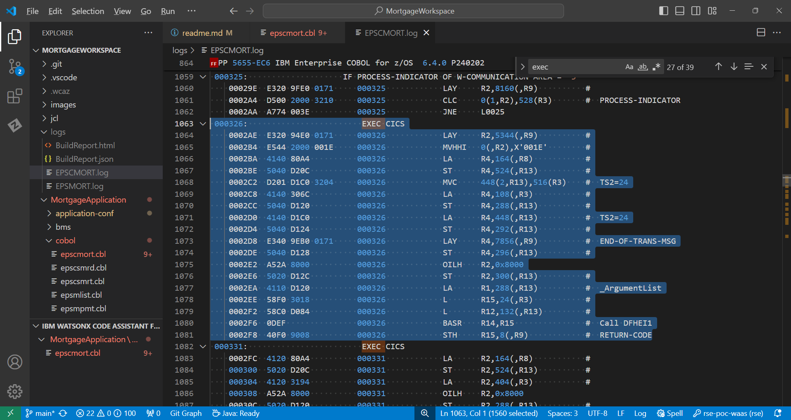
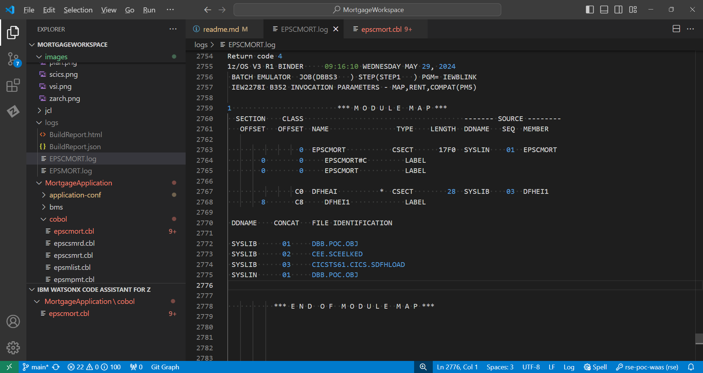
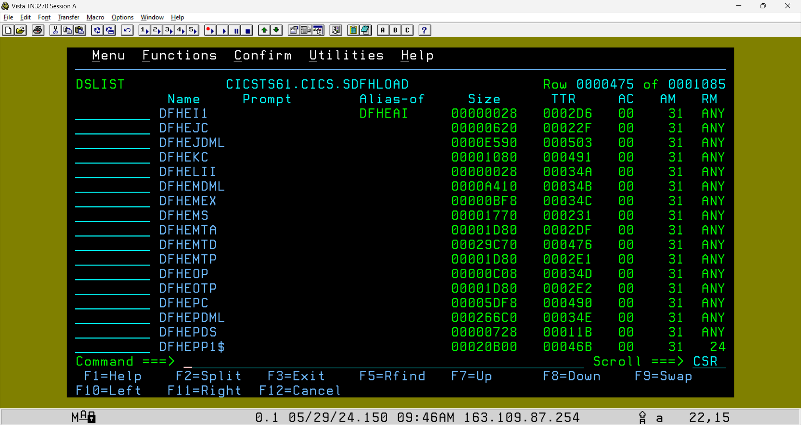

## A beginners guide to Cobol CICS/DB2 application development        
This was written for those new to zOS application development.  Its a very very basic walkthrough of the IBM sample 'MortgageApplication' (MortApp) included in this repo. This outlines how it works, and the various CICS and DB2 system level configurations it uses.

As a aid, links to external material have been included for further learning. 

#### zOS Development - Foundational concepts
Mainframe programs are written mostly in Cobol. Others can be in Assembler, PLI and other programming languages. Applications are composed of one or more programs and can use a mix of languages. Programs are designed to meet some specific business feature/solution. Applications and the data they process can be run as interactive (online) or as batch processes. 

**Interactive** applications use the IBM product [CICS](https://www.ibm.com/docs/en/zos-basic-skills?topic=zos-introduction-cics) or [IMS](https://www.ibm.com/docs/en/integration-bus/10.0?topic=ims-information-management-system).
  - They are designed to interact with users to gather and send data over a network connected text-based 3270 terminal. 
  - Modern interactive applications can substitute 3270 screens with a web front-end or other methods to access CICS programs and resources. 
 
**Batch** applications run using [Job Control Language - JCL](https://www.ibm.com/docs/en/zos-basic-skills?topic=jobs-what-is-batch-processing).  
 - Batch applications use JCL to process large amounts of data in 'batches' without user interaction. 
 - A JCL job is a sequence of step(s) that execute application programs or some utility like Sort, DB2 bind...
 - Each step includes one or more Data Definitions (DDs) that allocate DataSets by Name (DSN). They are the input/output files process by the program. 
 - Batch applications can also access data in DB2 tables, MQ Queues and a variety of other method. 
 - Jobs are submitted to the [Job Entry Subsystem - JES](https://www.ibm.com/docs/en/zos-basic-skills?topic=jobs-what-is-batch-processing) which allocates the files and executes the program in each step. 
<br /> 
   This example JCL step executes program IEFBR14 and allocates a DSN with the DDname of DD1. The 'SYSOUT=*' DDs are special files used by JES to display output/logs produced the program.
 


## Anatomy of a CICS Application  
A basic [CICS application](https://www.ibm.com/docs/en/cics-ts/5.6?topic=fundamentals-cics-applications) has several parts.  We will use the Mortgage Application to understand how to build, configure and run a typical CICS/DB2 application. 

**The Code**
- [cobol/eps**c**mort.cbl](../MortgageApplication/cobol/epscmort.cbl#L152) is the main program. It uses the "EXEC CICS" Cobol API to send the screen map defined in program **bms/epsmort**.   
<br />   

- [bms/epsmort.bms](../MortgageApplication/bms/epsmort.bms) is a 3270 [BMS](https://www.ibm.com/docs/en/cics-ts/5.6?topic=programs-basic-mapping-support) screen definition program written in assembler language.  
  - The compiler transforms this source file into 2 artifacts; a [symbolic copybook 'EPSMORT' and a physical executable load module](https://www.ibm.com/docs/en/cics-ts/6.1?topic=map-physical-symbolic-sets). 
  

  - The symbolic copybook source file is saved in a [Partitioned Dataset - PDS](https://www.ibm.com/docs/en/zos-basic-skills?topic=set-types-data-sets) allocated with the dbb-zappbuild "HLQ' argument. 
  - This PDS is then used as a SYSLIB in subsequent compiles. 
  - SYSLIB is a DDname to allocate a copybook PDS as input to the compiler.  
  - The compiler replaces a Cobol program's ```Copy some-copybook``` statement with the actual copybook source file during the build like in the [epscmort](../MortgageApplication/cobol/epscmort.cbl#L55) program.  
  <br />   
    
    Example epsmort copybook member

    
  
    ```A special note on DBB builds is that BMS copybooks are not stored in the source repo like other copybooks.  Instead they are stored in the PDS created during the DBB build of the BMS program. ```
    <br />   

- [cobol/epscsmrt.cbl](../MortgageApplication/cobol/epscsmrt.cbl) is a program that is called by EPSCMORT to calculate a mortgage. 
  - The data is returned using a [COMMAREA](https://www.ibm.com/docs/en/cics-ts/6.1?topic=affinity-commarea) copybook.  
  - In Cobol, a COMMAREA is a data structure used to exchange data between programs. They are normally defined and shared as copybooks.  
<br />

- [copybook/epsmtcom.cpy](../MortgageApplication/copybook/epsmtcom.cpy) is the COMMAREA used between EPSCMORT and EPSCSMRT programs. It includes 2 other copybooks. One for  input and another output data structures.
<br />   


## The infrastructure
The diagram below illustrates the different layers of a mainframe application.  zOS, the operating system is at the bottom and supervises all the work to support program execution and the hardware resources they use (not shown).   Above zOS are the online and batch subsystems.  Other subsystems, like DB2, are used across online and batch applications. The top layer represents mainframe applications. They access subsystem services or other application services through an API layer. 


Let's see how the source code ['EXEC CICS SEND MAP('EPMENU') MAPSET('EPSMORT') ...'](../MortgageApplication/cobol/epscmort.cbl#90-95) in EPSCMORT is transformed into a CICS API:

- At compile time, the 'EXEC' is translated into a 'Send Map' API to display a screen (screen and map are synonymous in CICS).   
- At link-edit time: 
  - this [static](https://www.ibm.com/docs/nl/cobol-zos/6.3?topic=program-examples-static-dynamic-call-statements) API is added to the new EPSCMORT load module.    
  - the API's location is defined as a SYSLIB PDS in dbb-zappbuild's cobol.groovy and 'build-conf/dataset.properties'.
- At runtime, when EPSCMORT calls the 'Send Map' API, CICS loads and executes the EPSMORT MAPSET to display its 3270 screen.  

``` Side Note: A load module is another name for an executable program. Or the output artifact of the link-edit (binder) step of a build. They also called API, stubs, or objects. ```

Here is a generic diagram showing the compile and link of the source for program 'PROGA' which includes a static link to program 'PROGB' 


### CICS Application Definitions
Once the MortApp is built, it needs to be defined to CICS.  This section outlines the Jobs used for those definitions.

- Transactions are CICS terminal command that start applications or utilities. 
  - [EPSP](./initVSI-JCL/dfhcsdup.jcl#L22) is the main MortApp **Transaction ID** (tranid). All CICS applications must have at least one tranid. 
  - When this tranid is entered on a CICS 3270 screen, CICS starts program EPSCMORT. 
  - The transaction also defines what group its in. A CICS group is a set resources that are common to an application.  In this case, EPSMTM is the group name for the MortApp. 
<br />   
- Transactions and all other CICS resources are defined using the IBM batch utility [DFHCSDUP](https://www.ibm.com/docs/en/cics-ts/6.1?topic=resources-defining-dfhcsdup). Or they can be defined with the CICS tranid CEMT ([here is a list of other CICS commands](https://www.tutorialspoint.com/cics/cics_transactions.htm)).  In the example JCL you will see lines (control cards) that define:
  - [DB2CONN](https://www.ibm.com/docs/en/cics-ts/6.1?topic=sources-defining-cics-db2-connection) - defines the DB2 connection to the DB2 subsystem 'DBD1'. It also defines the default DB2 'EPSPLAN' for this group (see DB2 definitions below). 
  - [DB2ENTRY](https://www.ibm.com/docs/en/cics-ts/6.1?topic=sources-defining-cics-db2-connection) - defines default DB2 properties  for all transactions in the group. 
  - MAPSET  - defines is the physical BMS load module that displays a 3270 screen (map).
  - PROGRAM - defines the individual programs that make up the rest of the MortApp. 
 


### CICS System Layer
Application teams focus on the various parts of their application and work with the CICS Admins to design the resources and definitions needed to run their code. 

CICS Admin also configure system-wide settings used across all applications.  The list of things they do is extensive.  But for our example, there are 2 key components needed to make MortApp run in a Stock WaaS image the Started Task and the SIP. 

**The CICS Started Task**
In simple terms, CICS runs like a batch job under JES.  The main difference is that its a long running job like a unix daemon task.  This type of job is called a 'Started Task' (STC).  

The CICS STC in WaaS 3.1


Application load modules are added to a PDS defined in CICS's JCL under the DDname [DFH**RPL**](../WaaS_Setup/initVSI-JCL/cicsts61-mod.jcl#L69).  That DDname (RPL for short) is an input dataset to the program [DFHSIP](../WaaS_Setup/initVSI-JCL/cicsts61-mod.jcl#L38) which is CICS. 

When a user enters the transaction EPSP, CICS checks the transaction's resource definition created with DFHCSDUP to find the program name EPSCMORT. CICS loads it from the RPL PDS and starts it. 

For performance reasons, CICS caches loaded program in memory.  When the prgram is changed, a CICS Newcopy command is used to refresh the cache.  A newcopy is executed with the CICS cmd ``` CEMT SET PROG(EPSCMORT) NEWCOPY ```


**The CICS [SIP](https://www.ibm.com/docs/en/cics-ts/5.6?topic=areas-sip-system-initialization-program)**
  The CICS 'System Initialization Program' file or SIP is the main configure file.   In a WaaS Stock image its is updated to enable the DB2Conn [DB2CONN](../WaaS_Setup/initVSI-JCL/dfh$sip1#L7) feature.


### DB2 Application Definitions
As illustrated below, programs are defined to DB2 using a [Plan](https://www.ibm.com/docs/ru/db2-for-zos/12?topic=recovery-packages-application-plans).  Plans are collections of DB2 packages. A package represents the DB2 resources used by a program.  

When a DB2 program is compiled, a DB2 DBRM artifact is created. The DBRM is then bound to DB2 to update its resource requirements before it could run.  

  
<br />   

- [epsbind.jcl](../../WaaS_Setup/initVSI-JCL/epsbind.jcl#12-17) binds the EPSCMORT  package. 
    -  The conrtol cards for the bind utility follow the "SYSTSIN DD *" line. 
    -  The DSN control card connects the job to the DBD1 DB2 subsystem.  
    -  It then Binds the package EPSCMORT from the PDS allocated with the "//DBRMLIB DD ...". Thats where DBB stores the DBRM when it builds the program. 
    -  Bind Package names the plan 'EPSPLAN' it belows too and and includes the application (PKLIST) package list also called a collection.  
    -  The Plan is defined once.  But Package bind must be executed whenever a new DBRM is created. 
    
**DB2 System layer**
Developers work with Database Administrators (DBAs) to define DB2 resources like tables, stored procs, plans, packages and other objects related to their application.  

In addition to their many tasks, DBAs maintain the DB2 Subsystem which, like CICS, is an STC.  In our WaaS environment the STC job name starts with the prefix DBD1. DB2 has seveal supporting STCs with the same prefix. 

***DB2 STC in WaaS 3.1**


### RACF Security 
RACF is the security subsystem for zOS and its subsystems.  There are other security products like 'Top Secret' and ACF2. On WaaS, RACF profiles are defined to allow CICS to connect to DB2.

The [racfdef.jcl](../../WaaS_Setup/initVSI-JCL/racfdef.jcl#12) job is run once to define the permission to enable these resources:   
 - RDEFINE FACILITY DFHDB2.AUTHTYPE.DBD1 - defines the security profile for the **DB2CONN** CICS resource created in the in DFHCSDUP job. 
 - RDEFINE FACILITY DFHDB2.AUTHTYPE.EPSE defines security for the **DB2ENTRY** resource. 
 - The 'PE' cards define which RACF User(s) can use the resource. 
   - In a WaaS environment, the IBMUSER is a special (root-like) user that is given READ access. 
   - The CICSUSER is CICS's RACF ID that is given the same access.  
 - The RDELETE cards are used to clean out the definitions when rerunning the job. 
  


## Other useful terms 
... tbd 


core 

There are severla layers of mainframe programmering to consider 
 1. Operating System it selft. In this case we are using z/OS ver 3.1. That the latest IBM release as of 2024.
   - System's programmers (sysProg) are responsibenl for installign and maintaint this layer   - 
   - They also install key system products like CICS, DB2 and others. These are sometimes called subsystems. 
   
 2. Subsystem Admin - These are Adminstrators for each type of subsystems with epertise in designing, configuring, maintaining subsystems 
   - CICS Admins - work with Application developement teams to degien and support their applications 
   - Database Admin (DBA) -  is responsible for simialr tasks for DB2
   - There can be many other roles like the MQ Admin, RACF, Networking, Data storage 
 3. The application layer, This  

There are other groups like those who manage the physical hardawre and the operations team who monitor day to day acitites and report issues to owning appliaciton or systems teams. 
 
Anatomy of a CICS DB2 application:
- using the cobol programms in the MortApp repo, you will see folder for 
  - bms - which is the source of Basic Mapping Support (bms or maps for short) files.   I know I said MortApp is a Cobol program but maps are an exceptin. They are assmebler progrsm.  There job is the 'map' text and input fields o na 3270 screen to get/set data to a user.  bms/epsmort is the main bms map. NOrmally the main map is a menu whith options ot other maps (Screen).
  - cobol - is the where the main code lives.   EPSCMORT is the main program that starts the application process.
  - copybook - in this example are files used by cobol prgrmas to define certain data structures. They are typcail created when 2 or more pgms needs share the same data layout - also called a record layout. 
  
## So how does this all work?
A CICS program is 'installed' into a cics subsystem also called region. A region is just a Started Task (STC) running all the time like a deamon in the distributed world. An STC is like any JCL Job submitted to JES (Job Entry Subsystm) to allocate files (DDs) and run programs.  

Some jobs, like batch applications, start and end in a short amount of time.  Others, like CICS and DB2 run all the time. 

Ther can be many parts to a CICS program.  In this example, we will look at the runtime aspects like:
    - load modules:
      - Just like batch programs, pgms not executed in CICS, CICS programs are complied and linked and stored in a load PDS. 
      - In CICS the load pds is also called the Resource Parameter List or DFH**RPL** DD statement of the CICS STC JCL.  Take a look ....
      - changes to load modules will require a special CICS cmd to refresh it. Thats callaed a 'newcopy' 
      - If the program uses DB2, a Database Request Module (DBRM) is created as part of the compile. It must bound to the DB2 subsytem used by the applicaiotn. 
    - ...
      - 
     like another other program.  The diffenrebce is it will include some CICS system programs to , CICS and DB2 defiA CICS application has many parts To create a


.... wasteland 


The also use several 'system' level services provided by CICS and in out case DB2. 

When designing an applicaiotn, teams normally collaborate with zOS system admins to help archtect the optimum design that also follows some organizational  standard. 

 program designed has several CICS resource definition; program, map, transaction and more.  


A map is a 3270 text screen layout. Its similar to how HTML works with input and output fields but not as pretty.
- EPSMORT is the MAPSET BMS program called by the API.
- EPSMORT then sends the EPMENU map to a user's terminal. 

- At compile time, the 'EXEC' statement is translated into an API call. In this case the APIs job is to load and run the MAPSET BMS load module EPSMORT.

- In the link phase of the build,
  -  the API is added as a [static](https://www.ibm.com/docs/nl/cobol-zos/6.3?topic=program-examples-static-dynamic-call-statements) load module into EPSCMORT.  
  -  The linker finds APIs which are members in the CICS system PDSs.  These are the same PDSs defined in dbb-zappbuild's 'dataset.properties' like the 'SDFHLOAD=CICSTS.CICS.SDFHLOAD' where APIs reside.

- At runtime, when 'EPSCMORT' call the API, CICS will load the service, the API accesses the subsystem and handles the data exchange. 

A load module is another name for an executable program. Or the output artifact of the link-edit (binder) step of a build. They are also called API, stubs and objects. 


**Warning!!! extremely  geeky topic**
As mentioned, the cobol compiler translates 'EXEC' statements into an API call.  You can see that, if you really want too, in the complier's SYSPRINT log. The section highlighted shows  the machine code generated from an 'EXEC CICS' statement. All those lines are needed to setup a call to the main CICS API 'DFHEI1'. 


In the binder part of the log, you can see that API being linked into the main EPSCMORT load module from a SYSLIB DD. 


To the right of the SYSLIB you'll see the "SEQ" number 03. That is a reference to third SYSLIB PDS in the [concatenation](https://www.ibm.com/docs/fr/zos/2.4.0?topic=files-partitioned-sequential-concatenated-data-sets) list as defined in dbb-zappbuild's cobol.groovy. 

SYSLIB 03 is the CICS system PDS where the API load module member was found.

