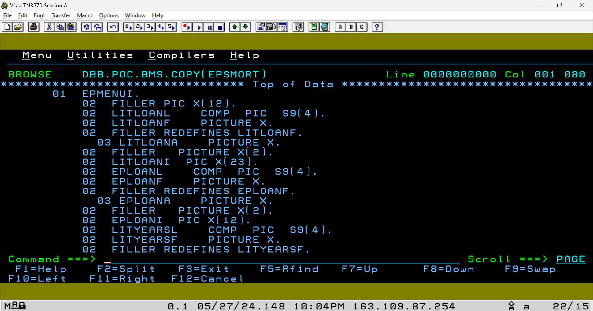
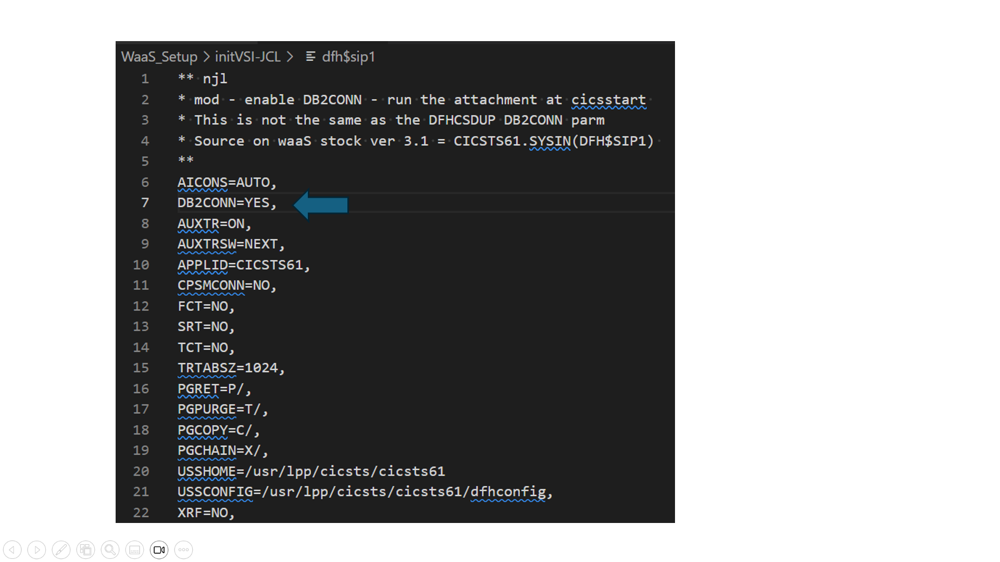
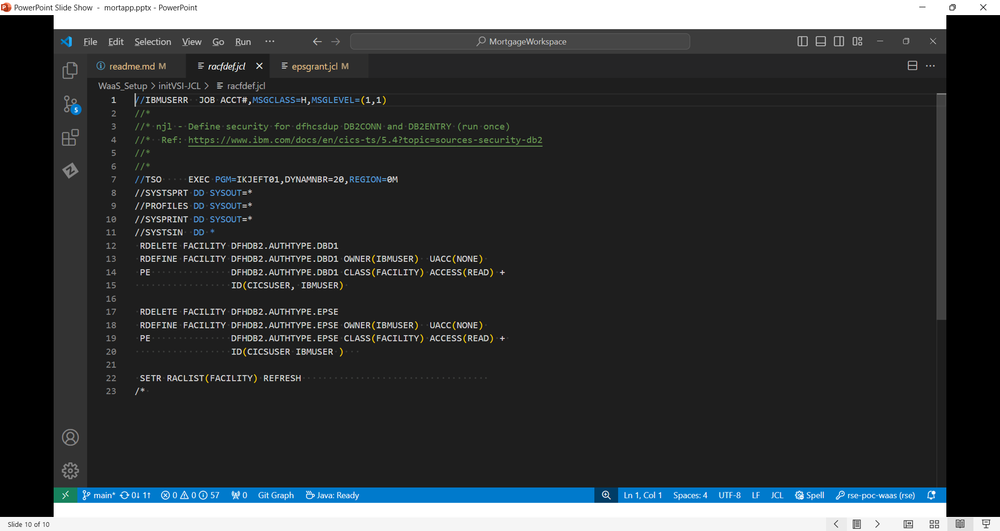

## A beginners guide to Cobol CICS/DB2 application development        
This is for those new to zOS application development. The goal is to provide an overview of how mainframe applications work. Using the sample 'MortgageApplication' (MortApp) in this repo, you will understand:
  - how CICS/DB2 applications are designed
  - how the are built with [IBM Dependency Based Build (DBB)](https://www.ibm.com/products/dependency-based-build)
  - the system resources used on a zOS environment like a WaaS 3.1 stock image. 

As an additional aid, links to external reference material are included for your research and learning. 

#### zOS Development - Foundational concepts
Mainframe programs are written mostly in Cobol. Others can be in Assembler, PLI and other programming languages. Applications are composed of one or more programs and be a mix of languages. Programs are designed to meet some specific business feature/solution. Applications and the data they process can be either interactive (online) or batch. 


**Interactive** applications use the IBM product [CICS](https://www.ibm.com/docs/en/zos-basic-skills?topic=zos-introduction-cics) or [IMS](https://www.ibm.com/docs/en/integration-bus/10.0?topic=ims-information-management-system).
  - They are designed to interact with users to gather and send data over a network connected text-based 3270 terminal. 
  - Modernized CICS applications substitute 3270 screens with a web front-end and other methods to access CICS. 
 
**Batch** applications run using [Job Control Language - JCL](https://www.ibm.com/docs/en/zos-basic-skills?topic=jobs-what-is-batch-processing).  
 - Batch applications use JCL to process large amounts of data in 'batches' without user interaction. 
 - A JCL is a sequence of step(s) that together makeup a job. 
 - Steps execute programs; application or utilities like Sort, DB2 bind...
 - Steps also include one file allocated as Data Definitions (DDs) by DataSet by Name (DSN). 
 - Applications use files or other data like DB2 tables, MQ Queues and a variety of other methods. 
 - Jobs have a RACF User and are submitted to the [Job Entry Subsystem - JES](https://www.ibm.com/docs/en/zos-basic-skills?topic=jobs-what-is-batch-processing) which allocates files and executes the program of each step. 
<br /> 
   This example JCL step executes the IBM utility program IEFBR14 and allocates a DSN with the DDname of DD1. The 'SYSOUT=*' DDs are special files used by JES to display output/logs produced by the program.
 


## Anatomy of a CICS Application  
A basic [CICS application](https://www.ibm.com/docs/en/cics-ts/5.6?topic=fundamentals-cics-applications) has several parts.  We will examine the Mortgage Application to understand how to build, configure and run it. 

**The Code**
- [cobol/eps**c**mort.cbl](../MortgageApplication/cobol/epscmort.cbl#L149-L154) is the main program. It uses the "EXEC CICS" Cobol API to display a screen defined in program **bms/epsmort**.   
<br />   

- [bms/epsmort.bms](../MortgageApplication/bms/epsmort.bms) is a 3270 [BMS](https://www.ibm.com/docs/en/cics-ts/5.6?topic=programs-basic-mapping-support) screen definition program written in assembler language.  
  - The compiler transforms this source file into 2 artifacts; a [symbolic copybook 'EPSMORT' and a physical executable load module](https://www.ibm.com/docs/en/cics-ts/6.1?topic=map-physical-symbolic-sets). 
  

  - The symbolic copybook is saved in a [Partitioned Dataset - PDS](https://www.ibm.com/docs/en/zos-basic-skills?topic=set-types-data-sets) allocated with the dbb-zappbuild "HLQ' argument. 
  - This PDS is then used as the SYSLIB in subsequent DBB builds. 
  - SYSLIB is the DDname used to allocate the copybook PDS as input to the compiler.  
  - A program accesses the EPSMORT symbolic copybook with the ['COPY   EPSMORT'](../MortgageApplication/cobol/epscmort.cbl#L54) Cobol statement. This causes the compiler to add the copybook to the program as shown this sample listing of the EPSMORT compile.
    
  
    ```A special note on DBB builds is that BMS copybooks are not stored in the source repo like other copybooks.  Instead they are stored in the PDS created during the DBB build of the BMS program. ```
    <br />   

- [cobol/epscsmrt.cbl](../MortgageApplication/cobol/epscsmrt.cbl) is a program that is called by EPSCMORT to calculate a mortgage. 
  - The data is returned using a [COMMAREA](https://www.ibm.com/docs/en/cics-ts/6.1?topic=affinity-commarea) copybook.  
  - In Cobol, a COMMAREA is a data structure used to exchange data between programs. They are normally defined and shared as copybooks.  
<br />

- [copybook/epsmtcom.cpy](../MortgageApplication/copybook/epsmtcom.cpy) is the COMMAREA used between EPSCMORT and EPSCSMRT programs. It includes 2 other copybooks. One for  input and another output data structures.
<br />   


## The infrastructure
The diagram below illustrates the different layers of a mainframe application.  zOS, the operating system, is at the bottom and supervises applications, subsystems (middleware) and the hardware resources they use (not shown).   Above zOS are groups for the online and batch subsystems.  DB2, MQ and other subsystems provide common services. At the top is the application layer and access subsystem services through an API layer. 


Let's examine how the Cobol source code ['EXEC CICS SEND MAP('EPMENU') MAPSET('EPSMORT') ...'](../MortgageApplication/cobol/epscmort.cbl#L149-L154) used in EPSCMORT is transformed into a CICS API:

- At compile time, this 'EXEC' is translated into a 'Send Map' CICS API call.   
- This API is a load module defined in a SYSLIB PDS DD in dbb-zappbuild's cobol.groovy and 'build-conf/dataset.properties'.
  
- At link-edit time, the API is [statically ](https://www.ibm.com/docs/nl/cobol-zos/6.3?topic=program-examples-static-dynamic-call-statements) linked to EPSCMORT to create a single load module.    
  
- At runtime, when EPSCMORT calls the 'Send Map', the CICS API loads and executes the EPSMORT MAPSET application program to display its 3270 map (map and screen are the same thing).  

``` Side Note: A load module is another name for an executable program. Or the output artifact of the link-edit (binder) step of a build. They also called API, stubs, or objects. ```

This diagram below illustrates how a static program or API like "PROGB" is linked into another main program "PROGA" to produce one load module. Notice how the source languages can be different; Cobol and Assembler in this case. 


### CICS Application Definitions
This section outlines how to install a new application in CICS using the MortApp as an example. 

All CICS applications have a least one transaction which is used to start a main program. 
  - EPSP is the MortApp **Transaction ID** (tranid). 
  - When EPSP its entered on a CICS terminal, CICS starts the main program EPSCMORT.   
<br />   

Transactions and all other CICS application resources are defined using the IBM batch utility [DFHCSDUP](https://www.ibm.com/docs/en/cics-ts/6.1?topic=resources-defining-dfhcsdup). The example JCL below shows the resource definitions needed for the MortApp:
  - GROUP(EPSMTM) is used to define all related application resources.  CICS commands and global properties can be performed at the group level like the 'DELETE GROUP' command which removes all resources for the group.
  - [DB2CONN](https://www.ibm.com/docs/en/cics-ts/6.1?topic=sources-defining-cics-db2-connection) - is the DB2 subsystem and DB2 plan used to connect any DB2 program in the group to the DB2 subsystem name DBD1.
  - [DB2ENTRY](https://www.ibm.com/docs/en/cics-ts/6.1?topic=sources-defining-cics-db2-connection) - provides the default DB2 properties for all transactions in the group. 
  - MAPSET  - defines EPSMORT as the physical BMS load module. 
  - PROGRAM - properties for each program. 
  


Installing the MortApp in CICS  
  - In CICS, the command ```'CEDA INSTALL GROUP(EPSMTM)'``` is used once to add the group to CICS. 


### CICS System Layer
Application teams focus on the various parts of their application and work the CICS Admins to design the resources and definitions needed to install and run their code. 

CICS Admins also configure system-wide settings used across all applications.  The list of things they do is extensive.  But for our example, there are 2 key components needed to enable a new application like the MortApp on a new system like a WaaS stock image; the CICS Started Task and the CICS SIP. 

**The CICS Started Task** 
<br /> 
In simple terms, CICS runs like a batch job under JES.  The main difference is that its a long running job like a unix daemon task.  This type of job is called a 'Started Task' (STC).  

Example CICS STC running in WaaS 3.1


CICS loads applications from the [DFH**RPL**](../WaaS_Setup/initVSI-JCL/cicsts61-mod.jcl#L69) 
DD in its STC JCL.  In a WaaS stock image, that JCL is modified to include the load PDS for the MortApp.   

In dbb-zappbuild, the HLQ "DBB.POC" will store load modules in "DBB.POC.LOAD" which was added to the modified CICS STC JCL. 


When EPSP is started, CICS loads and executes program EPSCMORT from a PDS in the RPL PDS. 

For performance reasons, CICS caches loaded programs in memory.  When a new version of a program is deployed, the cmd ```'CEMT SET PROG(EPSCMORT) NEWCOPY'``` will reload the module from the RPL and refresh CICS's cache. 


**The CICS [SIP](https://www.ibm.com/docs/en/cics-ts/5.6?topic=areas-sip-system-initialization-program)** 
<br /> 
The CICS 'System Initialization Program' file or SIP is the main configuration file.   In a WaaS stock image, it must be configured to enable the [DB2CONN](../WaaS_Setup/initVSI-JCL/dfh$sip1#L7) feature. This initializes the   attachment facility between CICS and DB2. 
  
<br />   

### DB2 Application Definitions
As illustrated below, programs are defined to DB2 using a DB2 [Plan](https://www.ibm.com/docs/ru/db2-for-zos/12?topic=recovery-packages-application-plans).  Plans are collections of DB2 packages. A package represents the DB2 resources used by a program.   
  

When a DB2 program is compiled, a DB2 Database Request Module (DBRM) artifact is created and [bound](https://www.ibm.com/docs/en/db2-for-zos/12?topic=zos-binding-application-packages-plans) to a package within a plan.   
<br />   

- [epsbind.jcl](../WaaS_Setup/initVSI-JCL/epsbind.jcl#L15) job binds the EPSCMORT package. 
    -  The in-stream control cards for the bind utility follow the "SYSTSIN DD *" line. 
    -  The 'DSN SYSTEM(DBD1)' command  connects the job to the DB2 subsystem named DBD1.
    -  'BIND PACKAGE(EPS) MEMBER(EPSCMORT)' reads the DBRM member EPSCMORT from the PDS allocated by the "DBRMLIB" DD and performs the bind. 
    -  A bind package must be performed each time a program is changed. 
    -  The 'BIND PLAN(EPSPLAN) PKLIST(EPS.*)' command:
       -  creates the plan "EPSPLAN" which is used in the 'DB2CONN' resource defined by the DFHCSDUP job.
       -  defines the plan's PKLIST "Package List" named "EPS.\*".  A PKLIST is a collection of one or more packages for a plan. 
       
- [epsgrant.jcl](../WaaS_Setup/initVSI-JCL/epsgrant.jcl#L19) run this job once to grant all users(public) access to execute the new EPSPLAN.  A grant is a DB2 command to manage access to resources. In a WasS environment access can be given to all.  In a production environment, access is normally given to a RACF group owned by an application like, for example, EPS. 
  


**DB2 System layer**
Developers work with Database Administrators (DBAs) to define DB2 resources like tables, stored procs, plans, packages and other objects related to their application.  

DBAs also maintain the DB2 subsystem which, like CICS, is an STC.  In the WaaS 3.1 stock image, the DB2 STC job name starts with the prefix DBD1. DB2 has several supporting STCs with the same prefix. 

**DB2 Subsystem STC in WaaS 3.1**


On the WaaS 3.1 stock image the a batch utility is needed to perform the application binds jobs previouly described.  
[dsntep2.jcl][dsntep2.jcl](../WaaS_Setup/initVSI-JCL/dsntep2.jcl)  is a job that is one once to enable this utility. 


### Resource Access Control Facility (RACF) - z/OS Security 
RACF is the security subsystem on zOS.  There are others like 'Top Secret' and ACF2. RACF is where you define users, resources and the profiles that permit a user's access to resources. Resources can be files, applications like CICS, TSO, Unix System Services and many others.  

All processes run under an authenticated user ID.  CICS and TSO use a login screen to authenticate users with a secret password. An SSH connection to zOS can authenticate users with a password, SSH key or zOS Certs. 

STCs like CICS, DB2, UCD Agent, pipeline runners are assigned a RACF user id by the zOS Security Admins.  This special ID is called a [protected account](https://www.ibm.com/docs/no/zos/2.4.0?topic=users-defining-protected-user-ids) and they tend to have a higher level of access privileges than users.  

In a new zOS environment, connectivity between [DB2 and CICS](https://www.ibm.com/docs/en/cics-ts/5.6?topic=interface-overview-how-cics-connects-db2) must be defined under RACF using a sample job like [racfdef.jcl](../WaaS_Setup/initVSI-JCL/racfdef.jcl#12).  It creates 2 facility classes and permissions need for that connection:
 - ```'RDEFINE FACILITY DFHDB2.AUTHTYPE.**DBD1**'``` - defines a DB2 RACF resource name ending in "DBD1". This is the same name used in the "DB2CONN=**DBD1**" resource defined in the DFHCSDUP job. "DBD1" is an example name. Any name can be used as long as they are the same in RACF and CICS.
    
- ```'RDEFINE FACILITY DFHDB2.AUTHTYPE.**EPSE**'``` defines a DB2 RACF resource name ending in "EPSE". This is the same name used in the "DB2ENTRY(**EPSE**)" defined in DFHCSDUP.  Any name can be used.
   

The 'PE' RACF commands creates profile to '**PE**rmit' user(s) access to a resource. In effect this allows the CICSUSER ID of the CICSTS61 STC to connect to the DB2 instance DBD1 and use the EPSE entry.

  
## Summary
The items explain here are the basic configurations for a simple CICS/DB2 application.  Real world production applications may include many other components that are defined similarly to what was described here. The goal was to provide the concept and key terms. 
