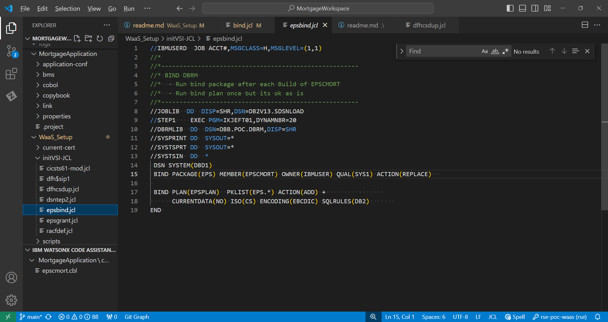
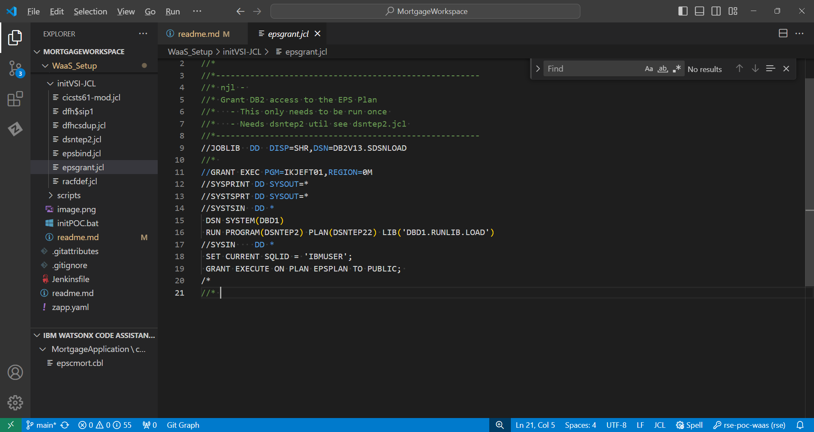

# Concepts in Mainframe Application Design, Configuration and Deployment
This is for those new to zOS application development. The goal is to provide an overview on how mainframe applications work. Using the IBM sample CICS/DB2 'MortgageApplication' (MortApp) found in this repo, you will understand:
  - basic CICS application design
  - application and system level configurations
  - build and deploy (non CD mode) 
  - considerations in porting an application to a new zOS environment like a [Wazi as a Service](https://www.ibm.com/docs/en/wazi-aas/1.0.0?topic=overview) (WaaS 3.1) stock image

As an additional aid, links to external reference material are provided. 


#### zOS Application Design Basics 
Mainframe programs are written mostly in Cobol. Others can be in Assembler, PLI and other programming languages. Applications are composed of one or more programs and can be a mix of languages. Programs are designed to meet some specific business feature/solution. Applications and the data they process can be either interactive (online) or batch. 


**Interactive** applications use the IBM product [CICS](https://www.ibm.com/docs/en/zos-basic-skills?topic=zos-introduction-cics) or [IMS](https://www.ibm.com/docs/en/integration-bus/10.0?topic=ims-information-management-system).
  - CICS is like a Distributed Application Server; JBoss, Apache, WebSphere and others.  Its purpose is to provide a runtime environment where zOS applications are deployed, executed and managed.
  - Interactive applications are designed to 'interact' with users to gather and send small amounts of data over a networked 3270 terminal (text based green screen). 
  - CICS can handle thousands of concurrent user sessions. 
  - Modernized CICS applications substitute 3270 screens with a web front-end and other methods to access  application back-end services. 
 
 Example CICS 3270 screen
 

**Batch** applications run using [Job Control Language - JCL](https://www.ibm.com/docs/en/zos-basic-skills?topic=jobs-what-is-batch-processing).  
 - Batch applications use JCL to process large amounts of data in 'batches' without user interaction. 
 - JCL is like a script with a sequence of step(s) that makeup a job. 
 - The JCL line ```"EXEC PGM=???"``` defines a step and the program it will EXECute like an application program or utility like Sort, DB2 bind...
 - Steps have one or more ```"DD DSN=???,..."``` lines which are Data Definitions (DD) used to create a new file or allocate an existing file by DataSet by Name (DSN).
 - Applications process data in files or other format like DB2 tables, MQ Queues and a variety of other methods. 
 - Jobs are submitted to the [Job Entry Subsystem - JES](https://www.ibm.com/docs/en/zos-basic-skills?topic=jobs-what-is-batch-processing) to execute the program(s) in  each step(s). 
 - Job security is managed by RACF - see below. 
<br /> 
   This example job executes the IBM utility program IEFBR14 and allocates a new DSN with the DD name of DD1. New file are allocated with certain attributes like logical record size and space needed on the a volume (disk).  The 'SYSOUT=*' DDs are allocated by JES to route program log files. 
 


## MortApp Design 
A basic [CICS/DB2 application](https://www.ibm.com/docs/en/cics-ts/5.6?topic=fundamentals-cics-applications) has business logic, a data layer and screen(s) that are also called map(s).  

The MortApp is designed with 4 types of source files; A main program, a map program, subprograms and COMMAREAs:
1. [eps**c**mort.cbl](MortgageApplication/cobol/epscmort.cbl#L149-L154) 
   - is the main program. 
   - it uses the ```"EXEC CICS SEND MAP ..."``` Cobol statement to call program **bms/epsmort**.   
   - it also uses ```"EXEC SQL ..."``` to access DB2 data. 
<br />   
1. [epsmort.bms](MortgageApplication/bms/epsmort.bms) 
   - is a 3270 [BMS](https://www.ibm.com/docs/en/cics-ts/5.6?topic=programs-basic-mapping-support) program written in assembler language.  
   - the compiler creates 2 artifacts from this source code:
     - a symbolic copybook
     - a physical load module  
   - when EPSCMORT is built, the compiler allocates the copybook SYSLIB PDS and adds the source to the program
   - **Note**- BMS copybooks are not stored in the application repo like other copybooks.  Instead they are stored in the PDS created during the DBB build of the BMS program.
  <br />   

1. [cobol/epscsmrt.cbl](MortgageApplication/cobol/epscsmrt.cbl) 
   - is a subprogram called by EPSCMORT ```"EXEC CICS LINK PROGRAM( W-CALL-PROGRAM ) **COMMAREA**( W-COMMUNICATION-AREA )"``` to calculate a mortgage. 
<br />  

1. [copybook/epsmtcom.cpy](MortgageApplication/copybook/epsmtcom.cpy)  
   - is the COMMAREA used to exchange data between programs
   - in Cobol, they are included in each program from a shared copybook PDS
   - COMMAREAs are designed  for this application. It includes 2 other copybooks; one for input the other for output data structures

**DB2** on zOS is an IBM product that provides Database services to interactive and batch applications.  Programmers use Structure Query Language(SQL) to read and write to DB2 tables. 


## Main Application Infrastructure Services
The diagram below illustrates the different layers used to support mainframe applications.  zOS, the operating system, is at the bottom and supervises applications, subsystems (middleware) and the hardware resources (not shown).   Above zOS are groups for the online and batch subsystems.  DB2, RACF and other subsystems provide common services across all types of applications. At the top is the application layer which access subsystem services through an API layer. 


Let's see how and API call is created from the Cobol source code [```"EXEC CICS SEND MAP('EPMENU') MAPSET('EPSMORT') ..."```](MortgageApplication/cobol/epscmort.cbl#L149-L154) used in EPSCMORT: 

- At compile time, the translate phase converts  ```"EXEC CICS ..."``` statements into the acutal code that calls the API. 
- dbb-zappbuild's cobol.groovy script defines the location of the  API with the SYSLIB DD in the link-edit phase.    
- At link-edit time, the API is [statically ](https://www.ibm.com/docs/nl/cobol-zos/6.3?topic=program-examples-static-dynamic-call-statements) linked to EPSCMORT to create a single load module.    
  
- At runtime, when EPSCMORT calls the 'Send Map', the CICS API loads and executes the EPSMORT MAPSET application program to display its 3270 map (map and screen are the same thing).  

The compiler 'pre-compiles' all ```"EXEC SQL ..."``` into  into DB2 API calls. 

The diagram below illustrates how a static program or API like "PROGB" is linked into another main program "PROGA" to produce one load module. Notice how the source languages can be different; Cobol and Assembler in this case. 


**Side Notes** 
 - A load module is another name for an executable program. Or the output artifact of the link-edit (binder) step of a build. They also called API, stubs, or objects. 
 - Load modules can be statically linked during the link-edit build phase as explained above.  Or they can be dynamically called at runtime where the 'system' finds and loads the program for execution. 
 - Modern Cobol compilers 'translate' and 'precompile' CICS and DB2 source before the final compilation phase. Previously, these phases were performed as 3 separate JCL steps; CICS Translate, DB2 precompile, Compile. 


### CICS Application Configuration 
This section outlines how to configure a new application in CICS using the MortApp as an example. 

All CICS applications have a least one transaction which is used as a starting point: 
  - EPSP is the MortApp **Transaction ID** (tranid). 
  - When EPSP its entered on a CICS terminal, CICS starts the main program EPSCMORT.   
  - EPSCMORT calls EPSMORT to send a Map to the user screen.
  - The user enters data in the screen which is sent back to the main program.  
  - This can be repeated until the user enters PF3 to end the transaction.


Transactions and all other CICS application resources are configured using the IBM batch utility [DFHCSDUP](https://www.ibm.com/docs/en/cics-ts/6.1?topic=resources-defining-dfhcsdup). The example JCL below shows the resource definitions needed for the MortApp:
  - GROUP(EPSMTM) is used to define all related application resources.  CICS commands and global properties can be performed at the group level like the 'DELETE GROUP' command which removes all resources for the group.
  - [DB2CONN](https://www.ibm.com/docs/en/cics-ts/6.1?topic=sources-defining-cics-db2-connection) - is the DB2 subsystem and DB2 plan used to connect any DB2 program in the group to the DB2 subsystem name DBD1.
  - [DB2ENTRY](https://www.ibm.com/docs/en/cics-ts/6.1?topic=sources-defining-cics-db2-connection) - provides the default DB2 properties for all transactions in the group. 
  - MAPSET  - defines EPSMORT as the physical BMS load module. 
  - PROGRAM - defines each program. 
  


**Installing the MortApp in CICS**
As a final step, applications are installed in CICS once using the following CICS commands: 
  - ```'CEDA INSTALL GROUP(EPSMTM)'``` installs the MortApp group 
  - ```'CEDA INSTALL DB2CONN(DBD1)'``` installs the DB2 Connect resource

### CICS System Layer 
Application teams focus on the various parts of their application and work the CICS Admins to design the resources and definitions needed to install and run their code. 

CICS Admins also configure system-wide settings used across all applications.  The list of things they do is extensive.  But for our example, there are 2 key components needed to enable a new application like the MortApp on a new environment; the CICS Started Task and the CICS SIP. 

**The CICS Started Task** 
In simple terms, CICS runs like a batch job under JES.  The main difference is that its a long running job like a unix daemon task.  This type of job is called a 'Started Task' (STC).  

Example CICS STC running in WaaS 3.1


CICS loads applications from the [DFH**RPL**](../WaaS_Setup/initVSI-JCL/cicsts61-mod.jcl#L69) DD in its JCL. In a new environment, that JCL is modified to include the load PDS for the application. 

Using dbb-zappbuild with the HLQ "DBB.POC" will store the MortApp load modules in "DBB.POC.LOAD" which is  added as the RPL in the CICS STC JCL. 


When EPSP is started, CICS loads and executes program EPSCMORT from the RPL PDS. 

For performance reasons, CICS caches loaded programs in memory.  During early dev and test, when new versions of a program is deployed, the cmd ```'CEMT SET PROG(EPSCMORT) NEWCOPY'``` is used to reload the module from the RPL and refresh CICS's cache. 


**The CICS [SIP](https://www.ibm.com/docs/en/cics-ts/5.6?topic=areas-sip-system-initialization-program)** 
The CICS 'System Initialization Program' file or SIP is the main configuration file.   In a new environment, it must be configured to enable the [DB2CONN](../WaaS_Setup/initVSI-JCL/dfh$sip1#L7) feature. This initializes the   attachment facility between CICS and DB2. 
  
<br />   

### DB2 Application Configuration 
As illustrated below, programs are defined to DB2 using a DB2 [Plan](https://www.ibm.com/docs/ru/db2-for-zos/12?topic=recovery-packages-application-plans).  Plans are collections of DB2 packages. A package represents the DB2 resources used by a program.   
  

When a DB2 program is precompiled, a DB2 Database Request Module (DBRM) artifact is created and [bound](https://www.ibm.com/docs/en/db2-for-zos/12?topic=zos-binding-application-packages-plans) to a package within a plan.   

[epsbind.jcl](../WaaS_Setup/initVSI-JCL/epsbind.jcl#L15) job binds the EPSCMORT package. 
-  The in-stream control cards for the bind utility follow the "SYSTSIN DD *" line. 
-  The 'DSN SYSTEM(DBD1)' command  connects the job to the DB2 subsystem named DBD1.
-  'BIND PACKAGE(EPS) MEMBER(EPSCMORT)' reads the DBRM member EPSCMORT from the PDS allocated by the "DBRMLIB" DD and performs the bind. 
-  A bind package must be performed each time a DB2 program is changed. 
-  The 'BIND PLAN(EPSPLAN) PKLIST(EPS.*)' command:
   -  creates the plan "EPSPLAN" which is used in the 'DB2CONN' resource defined by the DFHCSDUP job.
   -  defines the plan's PKLIST "Package List" named "EPS.\*".  A PKLIST is a collection of one or more packages for a plan. 

  
<br/>
<br/>


[epsgrant.jcl](../WaaS_Setup/initVSI-JCL/epsgrant.jcl#L19) is run once to grant public (all users) access to execute the new EPSPLAN.  A grant is a DB2 command to manage access to resources. In a WasS environment access can be given to all.  In a production environment, access is normally given to a RACF group owned by an application like, for example, EPS. 
  


**DB2 System layer**
Developers work with Database Administrators (DBAs) to define DB2 resources like tables, stored procs, plans, packages and other objects related to their application.  

DBAs also maintain the DB2 subsystem which, like CICS, is an STC.  In the WaaS 3.1 stock image, the DB2 STC job name starts with the prefix DBD1. DB2 has several supporting STCs with the same prefix. 

**DB2 Subsystem STC in WaaS 3.1**


On a new environment, the batch utility 'DSNTEP2' must be compiled to perform DB2 binds. 
[dsntep2.jcl](../WaaS_Setup/initVSI-JCL/dsntep2.jcl) is executed to install this utility. 


### Resource Access Control Facility (RACF) - z/OS Security 
RACF is the security subsystem on zOS.  There are others like 'Top Secret' and ACF2. RACF is where you define users, resources and the profiles that permit a user's access to resources. Resources can be files, applications like CICS, TSO, Unix System Services and many others.  

All processes run under an authenticated user ID.  CICS and TSO use a login screen to authenticate users with a secret password. An SSH connection to zOS can authenticate users with a password, SSH key or zOS Certs. 

STCs like CICS, DB2, UCD Agent, pipeline runners are assigned a RACF user ID by the zOS Security Admins.  This special ID is called a [protected account](https://www.ibm.com/docs/no/zos/2.4.0?topic=users-defining-protected-user-ids) and they tend to have a higher level of access privileges than users.  

In a new zOS environment, connectivity between [DB2 and CICS](https://www.ibm.com/docs/en/cics-ts/5.6?topic=interface-overview-how-cics-connects-db2) must be defined under RACF using a sample job like [racfdef.jcl](../WaaS_Setup/initVSI-JCL/racfdef.jcl#12).  It creates 2 facility classes and permissions need for that connection:
 - ```'RDEFINE FACILITY DFHDB2.AUTHTYPE.**DBD1**'``` - defines a DB2 RACF resource name ending in "DBD1". This is the same name used in the "DB2CONN=**DBD1**" resource defined in the DFHCSDUP job. "DBD1" is an example name. Any name can be used as long as they are the same in RACF and CICS.
    
- ```'RDEFINE FACILITY DFHDB2.AUTHTYPE.**EPSE**'``` defines a DB2 RACF resource name ending in "EPSE". This is the same name used in the "DB2ENTRY(**EPSE**)" defined in DFHCSDUP.  Any name can be used.
   

The 'PE' RACF commands creates profile to '**PE**rmit' user(s) access to a resource. In effect this allows the CICSUSER ID of the CICSTS61 STC to connect to the DB2 instance DBD1 and use the EPSE entry.

  
## Summary
Using the sample MortApp we covered the basic design and configuration concepts and tasks that are common across CICS/DB2 applications. These same tasks can be performed to port any CICS/DB2 application to a new zOS environment like a WaaS stock image or other new zOS environment. 

As illustrated below, additional DevOps processes and tools like Git, CI and CD can be add to a new environment to provide a full end-to-end DevOps worklow for early dev and test. 
