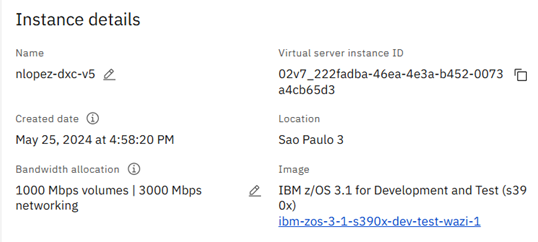
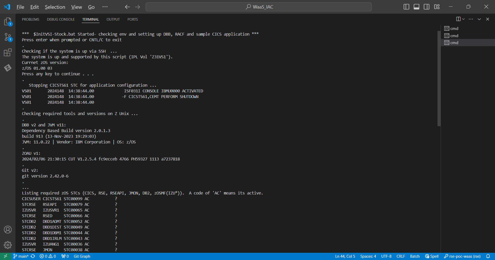
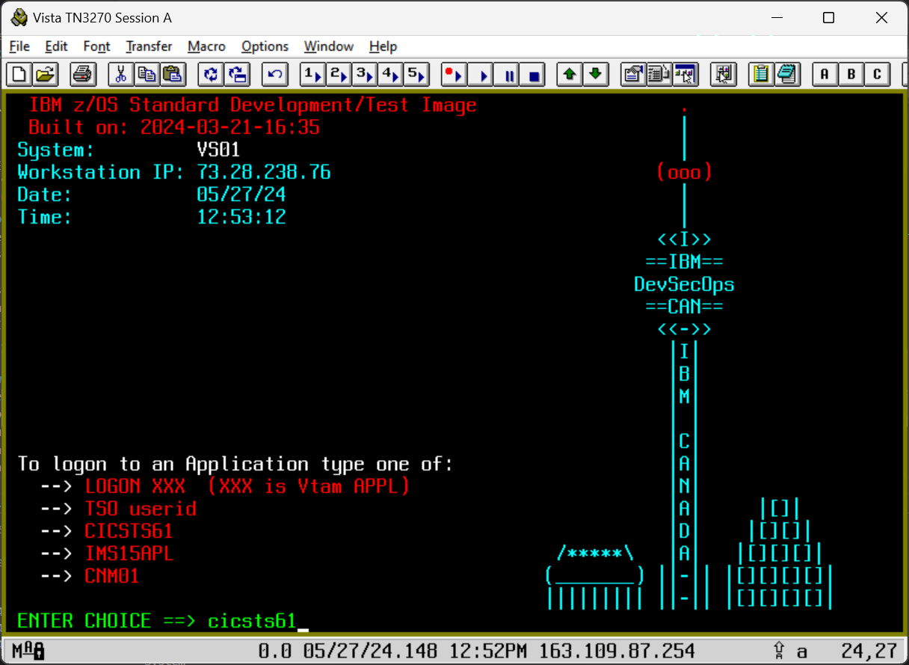
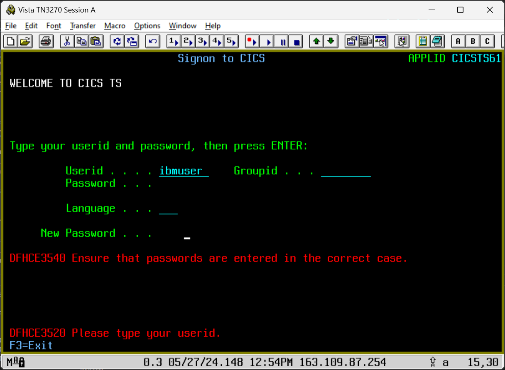
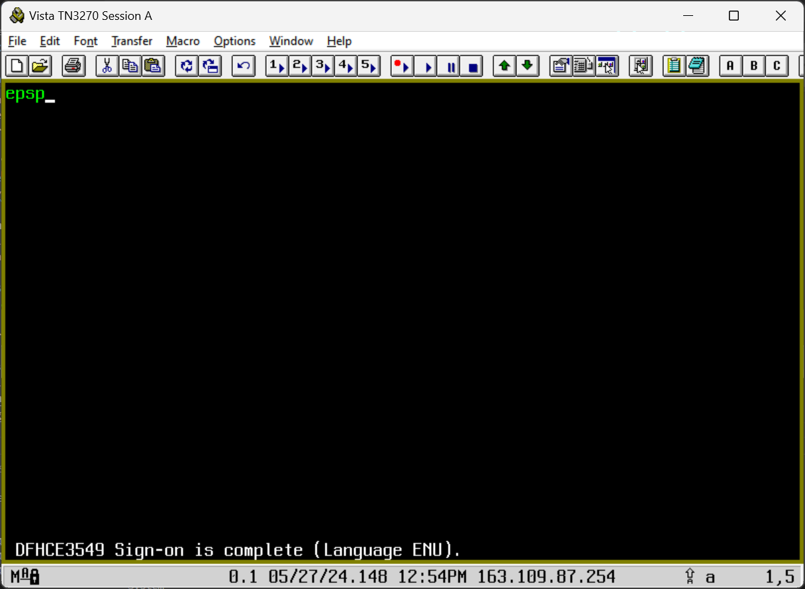

# DBB DevOps Proof of Concept (POC) with IBM WaaS Stock Image  

## Overview
This repo contains a sample CICS/DB2 Cobol application and a script to automate the install for a DevOps POC.  To get started, clone this repo and run  [initPOC.bat](Waas_Setup/initPOC.bat) from a Windows DOS terminal.  When it completes, use the default `IBMUSER` RACF user ID and default password 'sys1' to login to CICS. Then run the transaction  `EPSP` to verify the installation. As a final step, configure your IDE, IDz or vsCode, and any CI/CD orchestrator to run DBB based build and deploy pipelines. 


### General Information
WaaS stock images do **not** include a sample app or other DevOps/SDLC configurations like dbb-zappbuild, DB2 connection to CICS and several others settings. This script was created to address those needs.

The script has been tested with the z/OS 3.1 image shown below. Unfortunately, new stock images may introduce new system libraries that will require manual reconfiguration of this script. 

### Why a Windows Batch Script?
- Its small and simple. 
- It does not require any knowledge of specialized tools like Ansible, Terraform...
- IBM’ers with access to create a WaaS instance can use this for testing and learning.
- Customers with access to a pre-provisioned WaaS Instance can follow these same steps as part of a POC.
- See 
   [WaaS_Setup](WaaS_Setup/readme.md) 


  for a more detailed explanation what the script configures and the design of the sample app.

### PreReqs - Before Running the Script 
- Add the active VSI’s IP to your local `.ssh/config` with the entry name `poc-waas`:
   ```plaintext
   Host poc-waas
       HostName <VSI_IP>
       User IBMUSER
- Ensure your local SSH key can access the VSI.  
- Ensure the VSI is active and the z/OS IPL complete using the ssm cmd - ssh poc-waas 
- You will need Windows Admin rights to install the z/OS Certificate for 3270 and IDz access. 
  
### After the successfully completes  
- Genrate and add the zOS IBMUSER's public SSH key to your github server account using the zOS Unix cmd:
    - ssh-keygen  -t rsa -b 4096 -C 'ibmuser@ibm.com'        
- Configure your IDE, Git, CI and CD servers
- Ensure all WaaS/zOS IP ports are opened for use by the tools in your stack like:
    - 992 for secure 3270 with TLS 1.2  (login with IBMUSER and password 'sys1' using the your WaaS VSI IP
    - 8115 JMON for UCD and IDz
    - 8137-8139 for IDz over RSED STC
    - 8195 for Zowe over RSEAPI 
    - 10443 for Zowe over zOSMF as an alternative to RSEAPI
  - [The full list of stock image products and ports](https://www.ibm.com/docs/en/wazi-aas/1.0.0?topic=vpc-configurations-in-zos-stock-images)

Example Init Script output:    



### Build and unit testing: 
- The sample CICS Mortgage application is installed and configured in this WaaS VSI.  
- With IDz or vsCode, edit and build it with DBB using the '-HLQ' of 'DBB.POC'. 
- This app's CICS transaction is EPSP under pgm 'cobol/epscmort' and map 'bms/epsmort.bms'.

SAmple CEDA DIsplay of the sample App's  group (EPSMTM):


- The JCL folder has jobs to run DB2 Bind and CICS newcopy.
  - [jcl\newcopy.jcl](jcl\newcopy.jcl)  
  - [jcl\bind.jcl](jcl\bind.jcl)  
  - Changes to the main program EPSCMORT requires a DB2 bind
  - All programs require a newcopy. 
- As a test, use IDz or vsCode to change the BMS.
- Configure your CD pipeline to automate newcopy and binds. 
    
  
### Installed Helper Scripts: 
- A CICS newcopy script for IDz can be added to refresh a program after a user build.  In IDz change the DBB 'preferences/groovy prefix' with: 
    - <span style="font-size: 12px;">"sh /u/ibmuser/dbb-zappbuild/scripts/cics-newcopy.sh &; groovyz  -DBB_DAEMON_HOST 127.0.0.1 -DBB_DAEMON_PORT 8180  "</span>
    
- Several pipeline helper scripts are available in the CD, CI and UCD folder of '/u/ibmuser/dbb-zappbuild/scripts'
- Review the jenkinsfile example in the repo for examples on how to use these scripts.
   
### Helpful CICS transactions: 
-  CEDF=debug
-  CESF=logoff
-  CEMT=manage resources like "CEMT SET PROG(EPSCMORT) NEWCOPY"
  
### EPSP sample screen shots:
Login to CICS with IBMUSER and the default password sys1.  You must reset the password on first login. 
Then run the EPSP transaction to view the main application menu.



 
 
