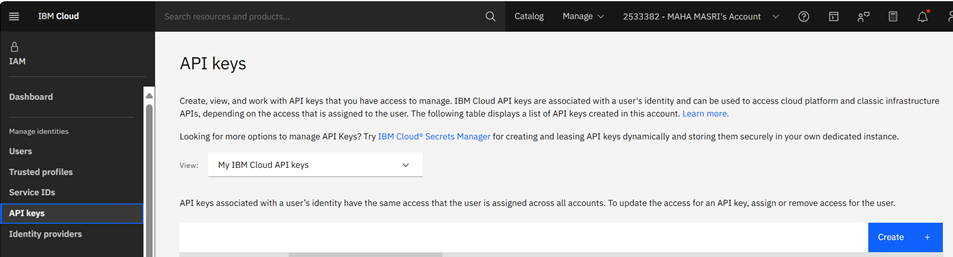

# DBB Proof of Concept (POC) using IBM WaaS Stock Image  

## Overview
This repo contains a sample CICS/DB2 Cobol application and a script to setup a basic z/OS DevOps environment for a POC. 
Clone this repo, and run  [initPOC.bat](Waas_Setup/initPOC.bat) in a Windows DOS terminal.
It will configure the system and the application where you can then run Dev and Test use cases with Git, DBB and other tools. 

When the script complete, use the default `IBMUSER` RACF user to log in to CICS and run the sample Transaction ID `EPSP`. 
Configure an IDE (IDz or vsCode) and any CI/CD pipeline orchestrator to run DBB based builds and Deploy the app in this repo. 


### General Information
WaaS stock images do **not** include a sample app or other DevOps/SDLC configurations like dbb-zappbuild, DB2 to CICS connection and several others.  
That is why this script was created. 

This version has been tested with the z/OS 3.1 image shown below. 
Unfortunately, new stock images may introduce new system libraries that will require manual reconfiguration of this script.


### Why a Windows Batch Script?
- Small and simple. Does not require and special tools or knowledge like Ansible, Terraform...
- Windows Admin rights will be needed during the z/OS Certificate install step. 
- If the prerequisites below are all in place, it will create a working demo of the sample IBM MortgageApplication.
- IBM’ers with access to create a WaaS instance can use this for testing and learning.
- Customers with access to a pre-provisioned WaaS Instance can follow these same steps as part of a POC.

### Before Running the Script (PreReqs)
- Ensure the VSI is running and the z/OS IPL is complete.
- It is assumed your local SSH key was used to create the VSI. This is needed to access z/OS. 
- IBM Cloud API key is configured on your PC:
   - Create an API key from the IBM Cloud UI - see imagae below.
   - Set the Windows environment variable `SETX IC_API_Key=???` with your API Key.



- Add the active VSI’s Floating IP (FIP) to your local `.ssh/config` with the entry name `poc-waas`:
   ```plaintext
   Host poc-waas
       HostName <Floating_IP>
       User IBMUSER 

### After the script runs 
- Add your IBMUSER public SSH key to your github server using the Z unix cmd:
    - ssh-keygen  -t rsa -b 4096 -C 'ibmuser@ibm.com'        
- Configure your IDE, Git, CI and CD servers
- Ensure all WaaS/zOS IP Ports are opened for use by the tools in your stack like:
    - 992 for secure 3270 with TLS 1.2  (login with IBMUSER and password 'sys1' using the your WaaS VSI IP
    - 8115 JMON for UCD and IDz
    - 8137-8139 for IDz over RSED STC
    - 8195 for Zowe over RSEAPI 
    - 10443 for Zowe over zOSMF as an alternative to RSEAPI
  - [The full list of stock image products and ports](https://www.ibm.com/docs/en/wazi-aas/1.0.0?topic=vpc-configurations-in-zos-stock-images)

Example Init Script output:    


### Build and unit testing: 
- The sample CICS Mortgage application is installed and configured in this WaaS VSI.  
- With IDz or vsCode edit and build it with DBB using the '-HLQ' of 'DBB.POC'. 
- This app's CICS transaction is EPSP under pgm 'cobol/epscmort' and map 'bms/epsmort.bms'.

CEDA Display of sample App's group (EPSMTM):


- The JCL folder has jobs to run DB2 Bind and CICS newcopy.
  - [jcl\newcopy.jcl](jcl\newcopy.jcl) is a newcopy job
  - [jcl\bind.jcl](jcl\bind.jcl) is the DB2 bind
  - Changes to the main program EPSCMORT requires a bind
  - all other pgms and maps just need a newcopy. 
- 
- As a test, use IDz or vsCode to change the map and view the results in CICS.  
- Configure your CD pipeline to automate newcopy and binds. 
    
  
### Installed Helper Scripts: 
- A CICS newcopy script for IDz can be added to refresh any pgm after a user build.  In IDz change the DBB 'preferences/groovy prefix' with: 
    - <span style="font-size: 12px;">"sh /u/ibmuser/dbb-zappbuild/scripts/cics-newcopy.sh &; groovyz  -DBB_DAEMON_HOST 127.0.0.1 -DBB_DAEMON_PORT 8180  "</span>
    
- Several pipeline helper scripts are available in the CD, CI and UCD folder of '/u/ibmuser/dbb-zappbuild/scripts'
- Review the jenkinsfile example in the personal repo cloned above for examples on using these scripts.
   
### Helpful CICS transactions: 
-  CEDF=debug
-  CESF=logoff
-  CEMT=manage resources like "CEMT SET PROG(EPSCMORT) NEWCOPY"
  
### EPSP sample screen shots:
Login to CICS with IBMUSER and the default password sys1.  You must reset the password on first login. 
Then run the EPSP transaction to view the main application menu.


 
### 
