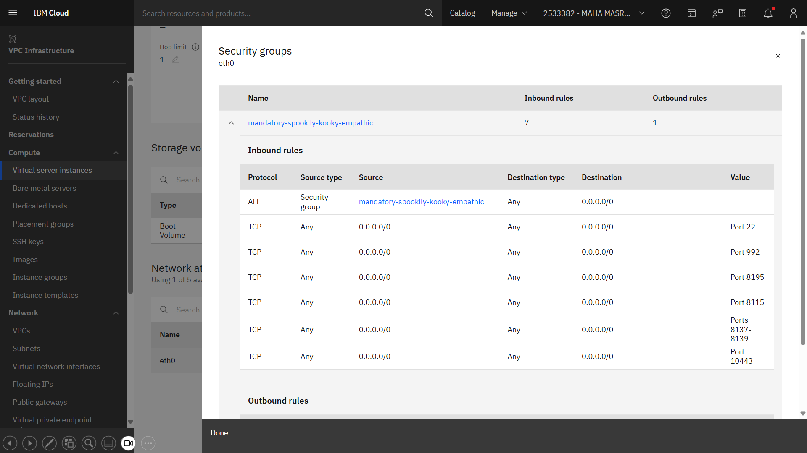

# DevOps Proof of Concept (POC) setup with IBM DBB and WaaS Stock Image v3.1 

Running a POC on a WaaS 3.1 image requires some customization. A script is included in this repo that automates many of the steps to install a sample CICS/DB2 application for running POC use cases. This can also serve as a reference on porting your application(s) and infrastructure for early dev and test workloads. 

### Prerequisites 
- You must have SSH access to a WaaS instance.
- Add your WaaS instance's IP to your local PC's  `.ssh/config` file with as: 
   ```plaintext
   Host poc-waas
       HostName <VSI_IP>
       User IBMUSER
- Test your connectivity using the ssh cmd from your PC - ```ssh poc-waas ```.
- Windows Admin rights is required to install the z/OS Certificate for 3270 and IDz access. 
- A 3270 emulator. Or use the remote host emulator in IDz.

## Getting Started 
1. clone this repo and run [WaaS_Setup/initPOC.bat](WaaS_Setup/initPOC.bat)  from a Windows DOS terminal
2. logon to CICSTS61 with IBMUSER and temp password 'sys1'. You will be required to reset the temp password.
3. run the 'EPSP' CICSTS61 transaction to verify the installation 
4. after the script:
   1. configure your IDE (IDz or vsCode)
   2. configure your CI/CD orchestrator 
   3. generate a zOS IBMUSER SSH key and cut/paste it into your git server account. SSH into zOS Unix and run:
    ```ssh-keygen  -t rsa -b 4096 -C 'ibmuser@ibm.com'```
- Open WaaS/zOS IP ports for use in your stack: 
    - 992 for 3270 access with TLS 1.2 (requires the install of the zOS cert) 
    - 8115 JMON for UCD and IDz
    - 8137 for IDz over RSED STC. Use 8137 as the main host port. 
    - 8195 for Zowe over RSEAPI 
    - 10443 for Zowe over zOSMF as an alternative to RSEAPI
    - [Here is the full list of stock image products and ports](https://www.ibm.com/docs/en/wazi-aas/1.0.0?topic=vpc-configurations-in-zos-stock-images)




### Build and Test
- Use the sample Mortgage application to run your POC use cases.  
- For vsCode, a sample IBM Open Editor "zapp.yaml" file is included in this repo.  See [how to configure vsCode and DBB](https://mediacenter.ibm.com/media/Configuring+DBB+User+Build+in+VSCode/1_ra0ttr68/189147203). 
- For IDz, see [how to config IDz with DBB](https://mediacenter.ibm.com/media/IBM+Dependency+Based+Build+CourseB+DBB+User+Build+in+IDZ/1_zszkr8l8).
- Set the [dbb-zappbuild](https://github.com/IBM/dbb-zappbuild) '**--hlq**' argument to 'DBB.POC' which adds your load modules to the default CICS RPL PDS. Or, configure your CD server to deploy to the 'DBB.POC.LOAD" RPL PDS defined in the 'SYS1.PROCLIB(CICSTS61)' STC. 
- Use the following DB2 Bind and CICS newcopy JCL: 
  - [jcl/newcopy.jcl](jcl/newcopy.jcl)  
  - [jcl/bind.jcl](jcl/bind.jcl)  
- Changes to the main program EPSCMORT requires a DB2 bind.
- All program changes require a newcopy
- The MortApp 'EPSP' transaction runs program 'MortgageApplication\cobol\epscmort.cbl' which displays the 'MortgageApplication\bms\epsmlis.bms' map.

The CICS 'CEDA DISPLAY GROUP(EPSMTMT)' of the MortApp resources:


    
     
### Additional Tips and References 
Some useful CICS transactions:
-  CEDF - enable debug session (EDF - disable with PF3)
-  CESF - logoff cics
-  CEMT - run various utility functions like "CEMT SET PROG(EPSCMORT) NEWCOPY"
-  press the 'clear' key to reset the screen


For general guidance on DevOps for z/OS see https://ibm.github.io/z-devops-acceleration-program/

For those new to CICS/DB2 concepts, the readme in this repo's [WaaS_Setup](WaaS_Setup/readme.md) folder describes the concepts, terminology and steps required to install a new mainframe application.  

  
### Sample MortApp Screen Shots
Login to CICS with IBMUSER and the default password sys1.  You must reset the password on first login. 
Then run the EPSP transaction to view the main application menu.

<figure>
  <figcaption>Start a CICS Session </figcaption>
  
</figure>

<figure>
  <figcaption>CICS logon with ibmuser password sys1 </figcaption>
  
</figure>

<figure>
  <figcaption>Start the EPSP transaction</figcaption>
  
</figure>

<figure>
<figcaption>The EPSP main map EPSMORT</figcaption>
 
</figure> 
