# Concepts in Mainframe Application Design, Configuration and Deployment
For those new to z/OS application development, exploring the IBM sample CICS/DB2 'MortgageApplication' (MortApp) in this repository can be a valuable reference. By studying MortApp, you can gain insights into several key areas:

- Basic CICS Application Design: MortApp serves as a practical example of how CICS applications are structured and designed. You can learn about the components that make up a typical CICS application, such as transactions, programs, and resources.

- Application and System Level Configurations: MortApp provides insights into the configurations required at both the application and system levels. You can understand how to define users, resources, and profiles in RACF, as well as configure CICS and DB2 for application execution.

- Build and Deploy Concepts (Non-CD Mode): Studying MortApp can help you grasp the concepts involved in building and deploying z/OS applications. You can learn about the steps and processes involved in compiling, linking, and deployment.

- Considerations for Porting Applications to New Environments: MortApp can also guide you on the considerations and best practices for porting a CICS/DB2 application to a new z/OS environment, such as a Wazi as a Service (WaaS) 3.1 stock image. This includes understanding the necessary configurations, dependencies, and environment-specific settings.

Additionally, external reference material is provided to supplement your learning and provide further insights into z/OS application development concepts.

### zOS Application Infrastructure Services
The diagram below illustrates the different software layers used to support mainframe applications.  
- zOS is the operating system, shown at the bottom, that supervises applications, subsystems (middleware) and the hardware (not shown). Systems Programmers install, patch, upgrade and tune this layer as well as support Systems Administrators and Developers.   

- In the middle are online, common, and batch services, which are managed by various systems administrators with specialized skills to configure, secure, and tune these services. They also support application teams during development and operations.

- The top layer, represents the business applications and the subsystem services they can use through one or more application programming interfaces (API).


### zOS Application Design Basics 
Mainframe programs are mostly written in the COBOL programming language. Other mainframe languages include Assembler, PL/I, and others. Applications are composed of one or more programs and can be a mix of languages. Programs are designed to fulfill specific business features or solutions. Applications and the data they process can be either interactive (online) or batch.


#### Interactive Applications use the IBM product [CICS](https://www.ibm.com/docs/en/zos-basic-skills?topic=zos-introduction-cics) or [IMS](https://www.ibm.com/docs/en/integration-bus/10.0?topic=ims-information-management-system).
  - CICS is like a Distributed Application Server; JBoss, Apache, WebSphere and others.  Its purpose is to provide a runtime environment where zOS applications are deployed, executed and managed.
  - Interactive applications are designed to 'interact' with users to gather and send small amounts of data over a networked 3270 terminal (text based green screen). 
  - CICS can handle thousands of concurrent user sessions. 
  - Modernized CICS applications substitute 3270 screens with a web front-end and other methods to access  application back-end services. 
 
 Example CICS 3270 screen

 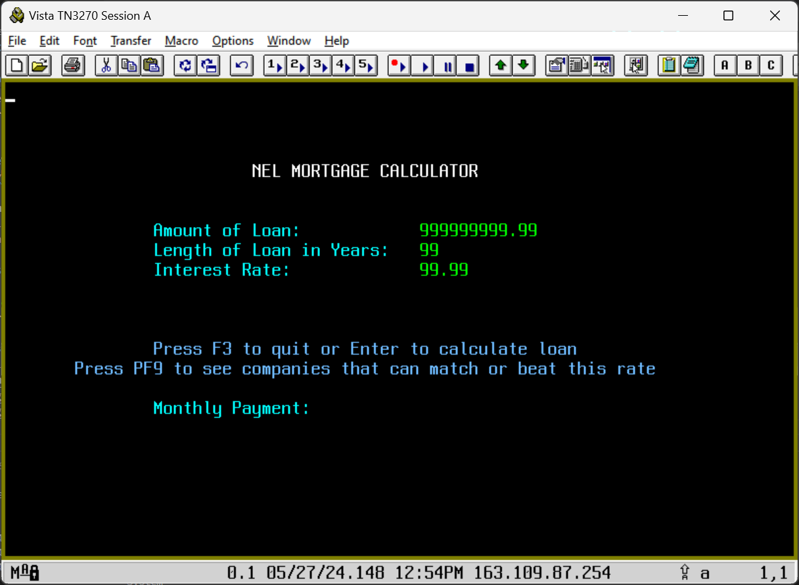

####  Batch Applications run using [Job Control Language - JCL](https://www.ibm.com/docs/en/zos-basic-skills?topic=jobs-what-is-batch-processing).  
 - They are designed to process large amounts of data in 'batches' without user interaction. 
 - JCL is like a script with a sequence of step(s) that makeup a job. 
 - The JCL line ```"EXEC PGM=???"``` defines a step and the program it will EXECute like an application program or utility like a Compiler, Sort, DB2 bind and many others. 
 - Steps have one or more ```"DD DSN=???,..."``` lines that are Data Definitions (DDs) used to create a new file or allocate an existing file by DataSet Name (DSN).
 - Applications process datasets allocated in JCL or provided by other services like DB2 tables, MQ Queues or a variety of other methods. 
 - Jobs are submitted to the [Job Entry Subsystem - JES](https://www.ibm.com/docs/en/zos-basic-skills?topic=jobs-what-is-batch-processing) that executes the step(s).   
 - Some processes/programs can run outside of JES like a Rexx exec or a Java process. However, these programs also use DDs to allocate traditional MVS files like a JCL job.  
 - Security for all JCL or non-JCL processes on zOS is enforced by RACF - see below for more details. 
<br/> 

## BBMM ***

In this example JCL, a step executes the 'BILL001' batch application program that resides in the DSN allocated by the 'STEPLIB DD'. This program reads data from the file allocated by the 'INPUT DD' and produces a report using the 'REPORT DD'. The 'SYSOUT=*' keyword is a special type of file allocated by JES. 
 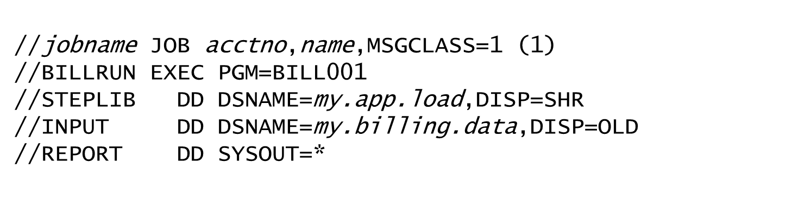
   

 This JCL executes the IBM COBOL Compiler utility program ['IGYCRCTL'](https://www.ibm.com/docs/en/cobol-zos/6.2?topic=jcl-writing-compile-programs). Except for the 'STEPLIB', several DDs are used to allocate input and output files used by the compiler.
 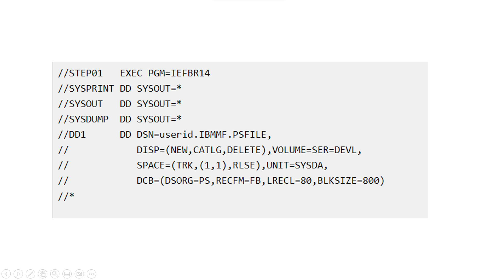


### Build and Deploy
A modern z/OS DevOps process typically utilizes [IBM Dependency Based Build (DBB)](https://www.ibm.com/products/dependency-based-build) within a CI/CD workflow. However, there are also other non-DevOps processes such as Endevor and Changeman that can build and deploy mainframe applications using traditional batch JCL jobs.

In general, they all perform the same basic steps: 
| Step  | Desc 
| ----- |----- 
|Compile | A compiler, like the Cobol compiler, transforms source code into object code. 
|Linkage Edit (linkedit) | Transforms object code into an executable load module. Linkedit is also referred to as the binder step and is not the same as the DB2 bind process. 
| Deploy | Load module(s) are packaged and copied (deployed) into a Load PDS on a host zOS environment like Dev, QA or Prod. For Online or Common services, a CICS Newcopy or DB2 Bind may be needed after each build and deploy. IMS applications have similar post-processing steps. A full deployment may include many other artifacts. For example, it can include changes to JCL for a batch programs, a DB2 table's structure or a new field on a CICS screen. 


   
Looking at the DBB build process as shown in the dbb-zappbuild Cobol.groovy snippet below, we can better understand how files are allocated and passed from the compile to the linkedit step when producing a deployable load module.

Just like a JCL step, this groovy code uses DBB's [MVSExec](https://www.ibm.com/docs/en/dbb/2.0?topic=commands-mvsexec) API to execute the Cobol and Linkage Editor programs.  
 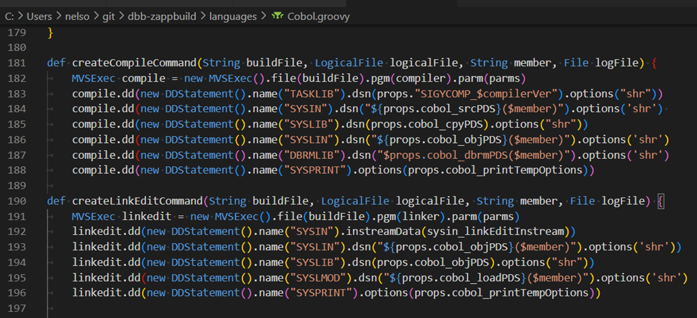
 
 

**The compile step (method) allocates these DDs**

| DD Name   | Purpose 
|-----------|---------
| TASKLIB   | The load PDS where the Cobol Compiler resides - like the 'STEPLIB' in JCL
| SYSIN     | Input member of a source PDS
| SYSLIB    | Input source copybooks
| SYSLIN    | Output member of an object PDS and passed to the linkedit step
| DBRMLIB   | Output member of a DB2 DBRM PDS used to bind DB2-based programs 
| SYSPRINT  | Output compiler log      

**Linkedit step DDs**
| DD Name   | Purpose                  
|-----------|---------
| SYSIN     | Input linked control cards (optional)    
| SYSLIN    | Input member of the object PDS passed from the compile step  
| SYSLIB    | Input load PDSs to include statically called application programs or subsystem APIs 
| SYSLMOD   | Output member(artifact) of an application's load PDS and used during deployment 
| SYSPRINT  | Output linkedit log    

_Side Notes_ 
- Notice that the linkedit method does not include a 'TASKLIB' DD statement. In this case, the operating system looks for the program in a special cache called the linklist that contains the DSNs of frequently used PDSs. This is similar to how a Unix PATH environment variable works when the system searches for executable programs.
  
- There are 2 basic PDS types; source and load:
  - In dbb-zappbuild, source PDSs for program members, DBRMs, and object decks are allocated (created) with the attributes ```srcOptions=dsorg(PO) recfm(F) lrecl(80) ```
  - Load uses ```loadOptions=dsorg(PO) recfm(U)   blksize(32760) ```
  - The main difference between source and load is the record format (recfm).  Source PDSs use a recfm(f) that defines a Fixed Logical Record Length(lrecl) of 80 bytes.  Load PDSs are defined with a recfm(u) or an Undefined record format. Each record in a member of a load PDS can be up to 32760 bytes - blksize(32760).  
  - The dataset organization, dsorg(po), defines these datasets as  Partitioned Organization or PDS for Partitioned Dataset for short.  
- Think of a PDS like a folder on a PC. The members in the PDS are like files in the folder. Each line in a file is a record, and it can be a fixed or undefined length.


## Example CICS/DB2 Application Design - MortApp
A basic [CICS/DB2 application](https://www.ibm.com/docs/en/cics-ts/5.6?topic=fundamentals-cics-applications) has business logic, a data layer, and screen(s) that are also called map(s) and various other system resources. 

### CICS Source Files Types   
The MortApp is designed with 4 types of source files; A main program, a map program, subprograms and COMMAREAs:
1. [eps**c**mort.cbl](MortgageApplication/Cobol/epscmort.cbl#L149-L154) 
   - is the main program. 
   - it uses the ```"EXEC CICS SEND MAP ..."``` Cobol statement to call program **bms/epsmort**.   
   - it also uses ```"EXEC SQL ..."``` to access DB2 data. 
  
2. [epsmort.bms](MortgageApplication/bms/epsmort.bms) 
   - is a 3270 [BMS](https://www.ibm.com/docs/en/cics-ts/5.6?topic=programs-basic-mapping-support) program written in assembler language.  
   - the compiler creates 2 artifacts from this source code:
     - a symbolic copybook
     - a physical load module  
   - when EPSCMORT is built, the compiler allocates the copybook SYSLIB PDS and adds the source to the program
   - **Note** BMS copybooks are not stored in the application repo like other copybooks.  Instead they are stored in the PDS created during the DBB build of the BMS program.
  
3. [Cobol/epscsmrt.cbl](MortgageApplication/Cobol/epscsmrt.cbl) 
   - is a subprogram called by EPSCMORT ```"EXEC CICS LINK PROGRAM( W-CALL-PROGRAM ) **COMMAREA**( W-COMMUNICATION-AREA )"``` to calculate a mortgage. 

4. [copybook/epsmtcom.cpy](MortgageApplication/copybook/epsmtcom.cpy)  
   - is the COMMAREA used to exchange data between programs
   - in Cobol, they are included in each program from a shared copybook PDS
   - COMMAREAs are designed  for this application. It includes 2 other copybooks; one for input the other for output data structures


### CICS API
Let's see how an API call is created from the Cobol source code [```"EXEC CICS SEND MAP('EPMENU') MAPSET('EPSMORT') ..."```](MortgageApplication/Cobol/epscmort.cbl#L149-L154) in EPSCMORT: 

- At compile time, the command is _translated_ into a CICS API service call. 
- At linkedit time, the API is [statically](https://www.ibm.com/docs/nl/Cobol-zos/6.3?topic=program-examples-static-dynamic-call-statements) linked from a SYSLIB PDS into EPSCMORT to create a single load module.      
- At runtime, when EPSCMORT issues the 'Send Map' command, the CICS API loads and executes the EPSMORT BMS program to display its 3270 map (map and screen are the same thing).  


### DB2 API
DB2 on z/OS is an IBM product that provides common database services to interactive and batch applications. Programmers use Structured Query Language (SQL) to read from and write to DB2 tables using DB2 APIs.

- At compile time, all ```"EXEC SQL ..."``` source code statements are _precompiled_ into DB2 API calls. 
- The compiler also outputs a DB2 DBRM file for the program.
- At linkedit time, the DB2 API is statically linked from a SYSLIB PDS into EPSCMORT to create a single load module.     
- Load modules can be linked with a mix of CICS, DB2 and many other subsystem APIs. 
- For DB2 based programs, a job is executed to Bind the program's DBRM to the DB2 subsystem. 

The diagram below illustrates how a static program or API like "PROGB" is linked into another main program "PROGA" to produce one load module. Notice how the source languages can be different; Cobol and Assembler in this case. 
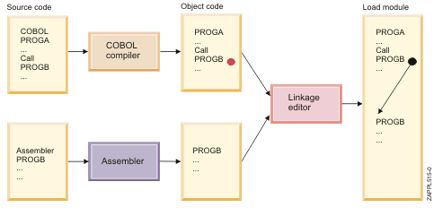

_Side Notes_ 
 - In addition to including copybooks, modern Cobol compilers _translate_ and _precompile_ CICS and DB2 source before the final compile phase.
 -  In older versions of the compiler,   translation and precompile were executed as pre-processor steps before the compile. 
 -  The output of a compile is called  Object Code (or Object Deck) and used as input to the linkedit phase.   
 - A load module is another name for an executable program. Or the output artifact of the linkedit (binder) step of a build. They are also called API, stubs, binaries or objects. 
 - Load modules can be statically linked during the linkedit phase as explained above.  Or they can be dynamically called at runtime were the 'system' finds and loads the program for execution. 
 - The member name of a load module is typically the same as the input object deck. However, in some cases, the name can be changed using an 'alias' linkedit control card, which renames the output load module. One reason for doing this is to ensure backward compatibility. For example, the IBM MQ API starting with 'CSQ*' can also be called using the newer 'DFH*' prefix. This allows older build JCL that includes a 'CSQ' API to still work while newer builds can use the new prefix.   

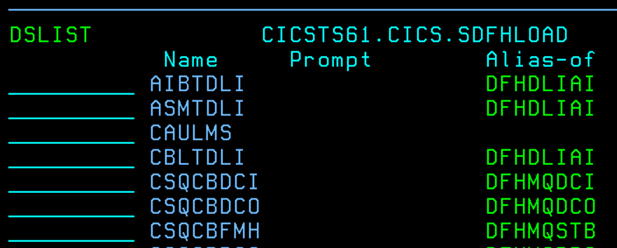


## CICS  Resource Definitions  
This section outlines how the resources of a new application are defined in CICS, using MortApp as an example.

### Application Architecture  - MortApp
All CICS applications have a least one transaction that is used as a starting point: 
  - EPSP is the MortApp **Transaction ID** (tranid). 
  - When EPSP its entered on a CICS terminal, CICS starts the main program EPSCMORT.   
  - EPSCMORT calls EPSMORT to send a Map to the user screen.
  - The user enters data in the screen that is sent back to the main program.  
  - This can be repeated until the user enters PF3 to terminate the transaction.  
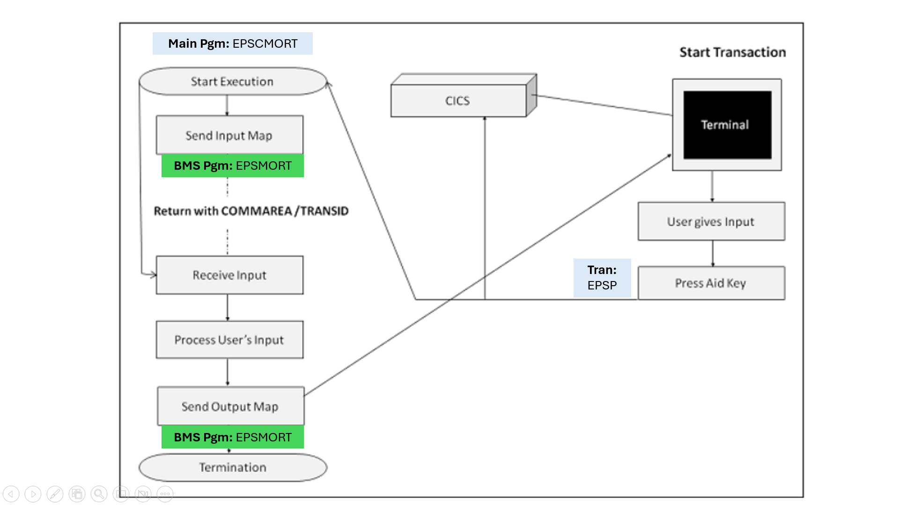


### Defining Application Level Resources (DFHCSDUP/CEMT)  
Transactions and all other CICS application resources are configured using the IBM batch utility [DFHCSDUP](https://www.ibm.com/docs/en/cics-ts/6.1?topic=resources-defining-dfhcsdup). The example JCL below shows the resource definitions needed for the MortApp:
  - GROUP(EPSMTM) is used to define all related application resources.  CICS commands and global properties can be performed at the group level like the 'DELETE GROUP' command that removes all resources for the group.
  - [DB2CONN](https://www.ibm.com/docs/en/cics-ts/6.1?topic=sources-defining-cics-db2-connection) - is the DB2 subsystem and DB2 plan used to connect any DB2 program in the group to the DB2 subsystem name DBD1.
  - [DB2ENTRY](https://www.ibm.com/docs/en/cics-ts/6.1?topic=sources-defining-cics-db2-connection) - provides the default DB2 properties for all transactions in the group. 
  - MAPSET  - defines EPSMORT as the physical BMS load module. 
  - PROGRAM - defines each program. 
  
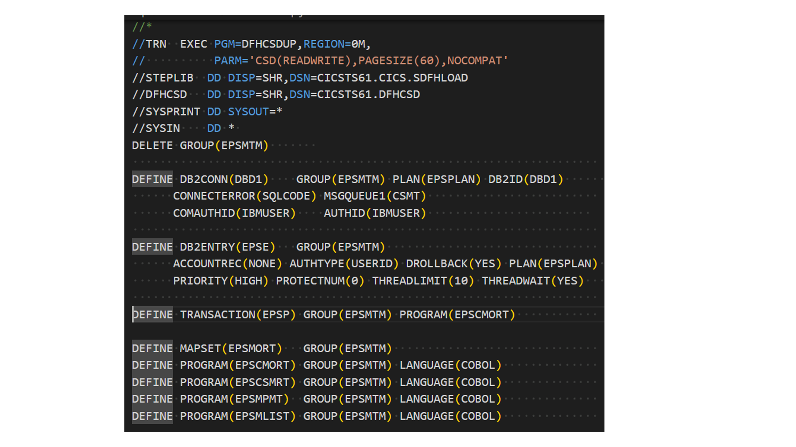

As a final step, MortApp is added (installed) once to CICS with the  commands:
  - ```'CEDA INSTALL GROUP(EPSMTM)'``` installs the MortApp group 
  - ```'CEDA INSTALL DB2CONN(DBD1)'``` installs the DB2 Connect resource

Use the CICS command ```"CEDA DISPLAY GROUP(EPSMTM)"``` to view the installed definitions for the MortApp group:

 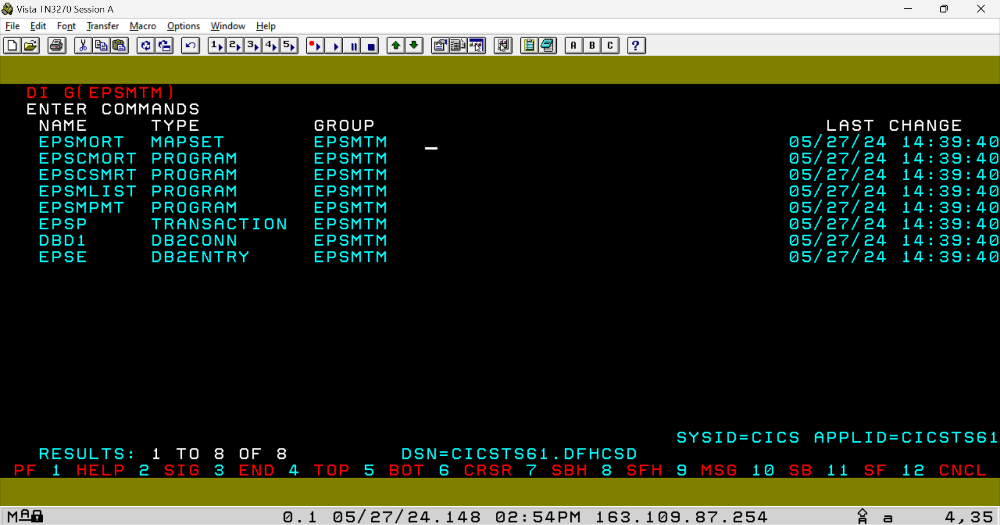
 

As shown above, tab over to an entry and enter **V** to view more details:
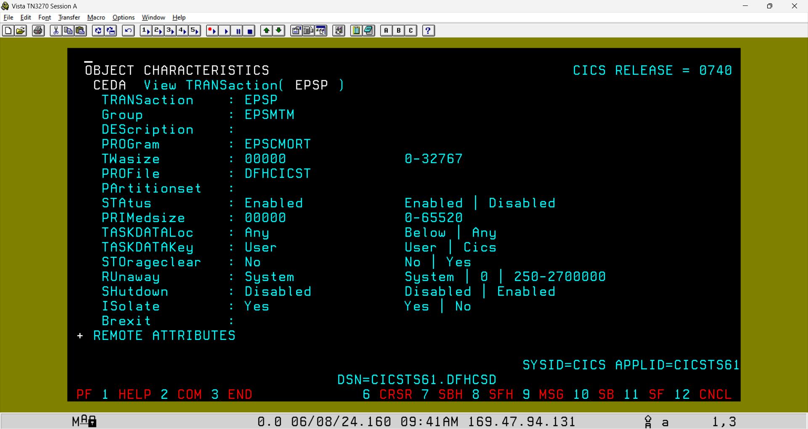


### Defining CICS System Layer Resources  
Application teams focus on the various parts of their application and work with Systems Admins to define the resources needed to run their code. 

In addition to application level configurations, CICS Admins configure system-wide settings used across all applications.  The list of things they do is extensive.  But for our example, there are 2 key components needed to enable a new application like MortApp on a new environment; the CICS Started Task and the CICS SIP. 

#### The CICS Started Task 
In simple terms, CICS runs like a batch job under JES, but with a key difference—it's a long-running job, similar to a Unix daemon task. This type of job is called a 'Started Task' (STC), which is configured to automatically start when z/OS is IPLed (Initial Program Load, also called boot).

Example CICS STC running in WaaS 3.1
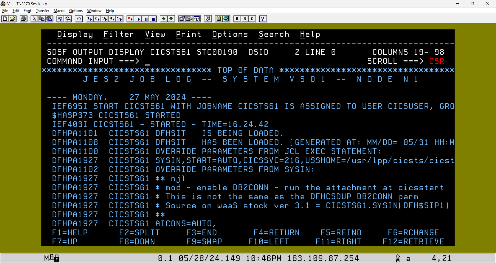


CICS loads applications from the DFH**RPL** DD in its JCL. That DD is modified to include the load PDS(s) of all CICS applications. 

When using DBB's dbb-zappbuild framework, use the "HLQ='DBB.POC'" argument to store load artifacts into "DBB.POC.LOAD". That PDS must be included in the CICS JCL RPL DD concatenation. 
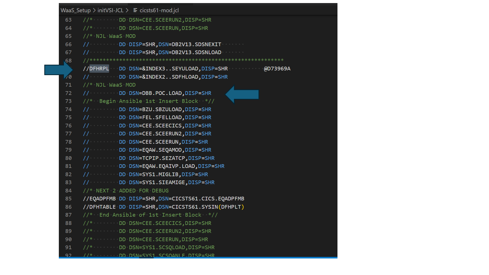

Using DBB this way, is a shortcut for deploying a load module during a User Build. Normally, a Deployment server is used to copy a load module into an RPL library. 


#### What is a CICS Newcopy 
When EPSP is started, CICS loads and executes program EPSCMORT from the RPL lib. 

For performance reasons, CICS caches loaded programs in memory.  During early dev and test, as new versions of a program are tested, the CICS command  ```'CEMT SET PROG(EPSCMORT) NEWCOPY'``` is required to reload the module from the RPL and refresh CICS's cache. 

The batch job [newcopy.jcl](jcl/newcopy.jcl) can be used to run that command. 


#### The CICS [SIP](https://www.ibm.com/docs/en/cics-ts/5.6?topic=areas-sip-system-initialization-program)
The CICS 'System Initialization Program' file or SIP is the main configuration file.   In a new environment, it must be configured to enable the DB2CONN feature as shown below. This enables the attachment facility between CICS and DB2. 
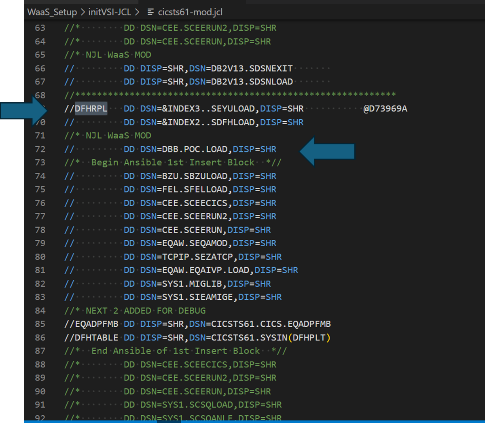  
<br/>   

## DB2 Application Configuration 
Applications that use DB2 require several predefined resources like, data tables, a  plan and security.

### DB2 Application Plan & Package 
The diagram below shows how a plan is a collection of packages. Each represents the resources used by a program like a data table.
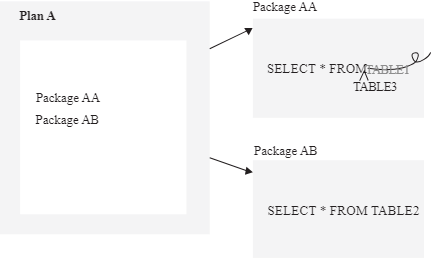  

When a DB2 program is _precompiled_, a DB2 "Database Request Module" (DBRM) artifact is created and [bound](https://www.ibm.com/docs/en/db2-for-zos/12?topic=zos-binding-application-packages-plans) to a package within a plan.   

[bind.jcl](jcl/bind.jcl) is an example DB2 bind package job for the EPSCMORT program. 
-  The ```"SYSTSIN DD *"``` in-stream control cards define: 
   -  ```'DSN SYSTEM(DBD1)'``` command  that connects the job to the DB2 subsystem named DBD1.
   -  ```'BIND PACKAGE(EPS) MEMBER(EPSCMORT)'``` reads the DBRM member EPSCMORT from the PDS allocated by the "DBRMLIB" DD and performs the bind. 
   -  A bind package must be performed each time a DB2 program is changed. 
  
On a new environment, a DBA initializes an application's plan and grant the owning team access once.
   - The ```"BIND PLAN(EPSPLAN) PKLIST(EPS.*)"``` db2 command creates plan "EPSPLAN" that is also used in the ```"DEFINE DB2CONN(DBD1)    GROUP(EPSMTM) PLAN(EPSPLAN) DB2ID(DBD1)"``` resource defined in the the DFHCSDUP job.
   -  This command also defines the plan's PKLIST "Package List" named "EPS.\*".   A PKLIST is a _collection_ of one or more packages for a plan.   Once the plan is created, a developer simply runs the bind package job to apply new DBRMs when testing changes. 
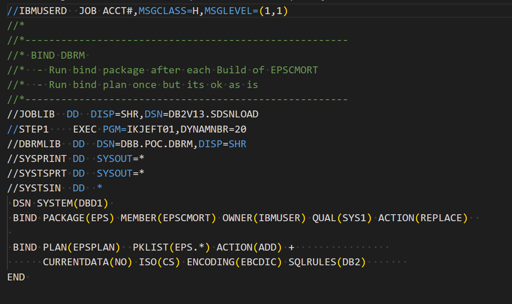  
<br/><br/>

   - The ```"GRANT EXECUTE ON PLAN EPSPLAN TO PUBLIC"``` grants public access to execute EPSPLAN.  - A grant is a DB2 command to manage access to resources. 
   - In a WasS environment access can be given to all.  In a production environment, access is normally given to a RACF group assigned to an application like, for example, EPS. 
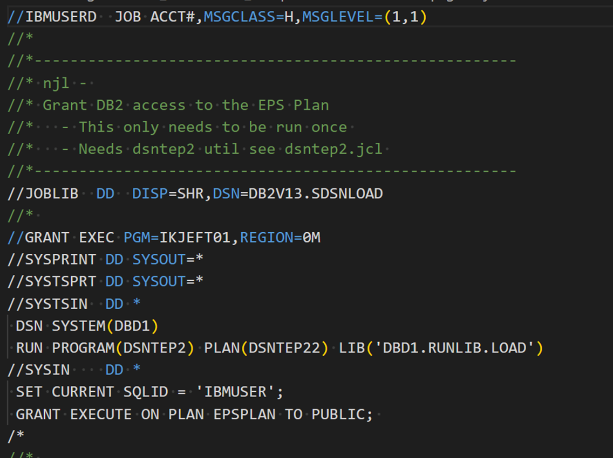  
 
_Side Notes_ 
- The create Plan and Grant are performed once by a DBA to initialize a new application.
- The package bind job is performed by developers each time a DB2 programs is changed. 
- These jobs require the DSNTEP2 utility described below. 


### Defining Basic DB2 System Resources 
Developers collaborate with DB2 System Administrators (DBAs) to define DB2 resources such as tables, stored procedures, plans, packages, and other objects related to their applications.

DBAs also maintain the DB2 subsystem, which, like CICS, is a Started Task (STC). In the WaaS 3.1 stock image, the DB2 STC job name starts with the prefix DBD1. DB2 has several supporting STCs with the same prefix that provide various services.
**DB2 Subsystem STC in WaaS 3.1**
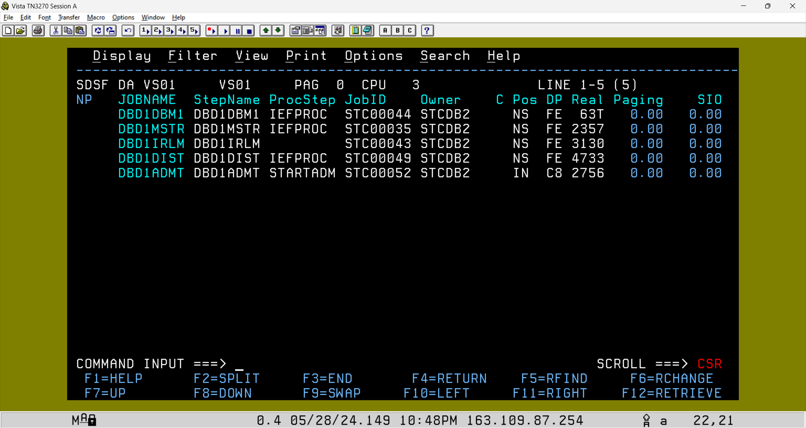


On a new environment, the sample batch job below is executed once to install the DB2 utility "DSNTEP2" that is used to define and update DB2 application resources like bind plan and grant: 
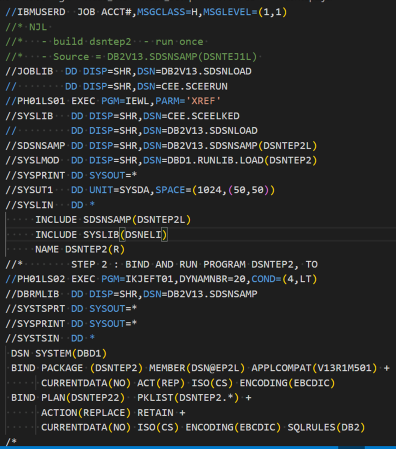


## Resource Access Control Facility (RACF) - z/OS Security 
RACF is the security subsystem on z/OS, responsible for defining users, resources, and profiles that govern user access to resources. Other security subsystems like 'Top Secret' and ACF2 are generically referred to as the "Security Access Facility" or SAF. Resources can include files, applications like CICS, TSO, Unix System Services, and many others.

All processes run under an authenticated user ID.  CICS and TSO use a login screen to authenticate users with a secret password. An SSH connection to zOS can authenticate users with a password, SSH key or zOS Certs. 

STCs like CICS, DB2, UCD Agent, pipeline runners are assigned a RACF user ID by the zOS Security Admins.  This special ID is called a [protected account](https://www.ibm.com/docs/no/zos/2.4.0?topic=users-defining-protected-user-ids) and they tend to have a high level of access privileges.  

### Connecting CICS and DB2 
In a new zOS environment, authorization to connect [CICS to DB2](https://www.ibm.com/docs/en/cics-ts/5.6?topic=interface-overview-how-cics-connects-db2) requires RACF permission. The example job below defines 2 facility class resources and the permissions to use them:
 - ```'RDEFINE FACILITY DFHDB2.AUTHTYPE.DBD1'``` - defines a resource name ending in **"DBD1"** that is the name of the "DB2CONN=**DBD1**" resource defined in the DFHCSDUP job. "DBD1" is an example name. Any name can be used as long as they match.  This example uses the DB2 subsystem name DBD1.
    
- ```'RDEFINE FACILITY DFHDB2.AUTHTYPE.EPSE'``` defines a resource name ending in **"EPSE"** that is the "DB2ENTRY(**EPSE**)" resource name defined in DFHCSDUP.  Any name can be used as long as they match. 
   

The 'PE' RACF commands create profiles to '**PE**rmit' user(s) access to a resource. This example permits the CICSUSER ID to connect to the DB2 instance DBD1 using the EPSE entry.
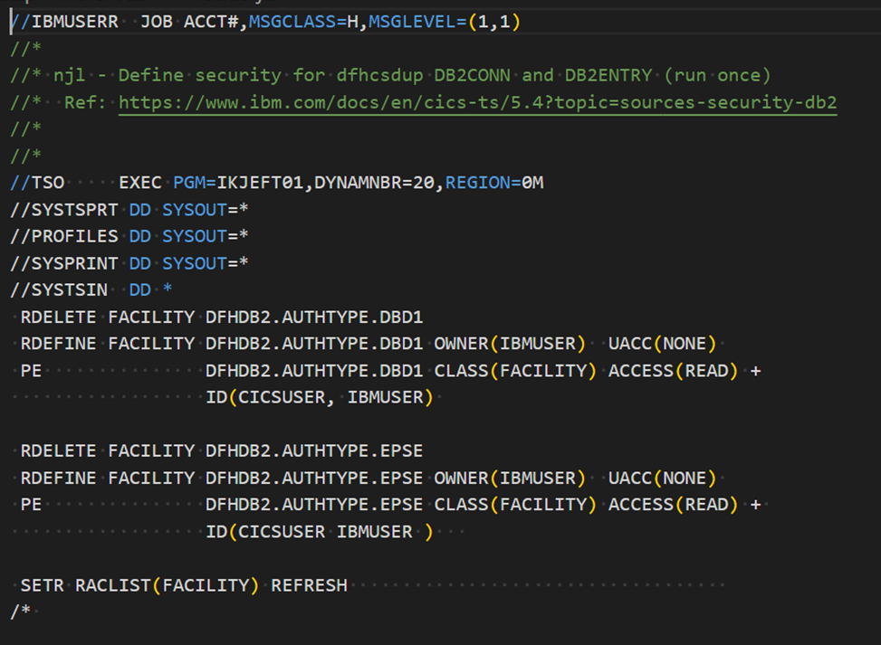
 

The System Security Admin role typically provides RACF access to all users in an organization, including administrators. In a WaaS environment, the default RACF user, 'IBMUSER', has special privileges to perform all system-related tasks."

## Summary
When you examine MortApp, you're gaining insights into the architecture and configuration requirements of CICS/DB2 applications for deployment in new environments. This knowledge is transferable, allowing you to apply similar principles and configurations when migrating other CICS/DB2 applications to different z/OS environments.

Integrating additional DevOps practices involves leveraging tools like Jenkins or IBM DBB for automated build processes, and implementing CI/CD pipelines to automate testing and deployment tasks. 

By incorporating these tools and practices, you can establish an end-to-end DevOps workflow that enhances development efficiency, promotes collaboration, and improves the overall reliability of your applications across diverse z/OS environments. 
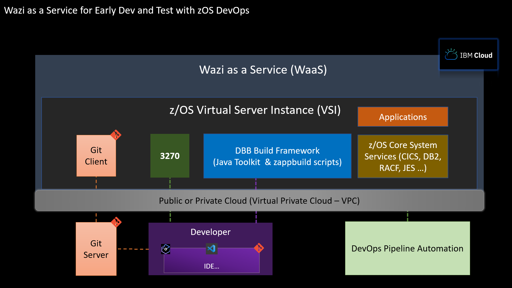